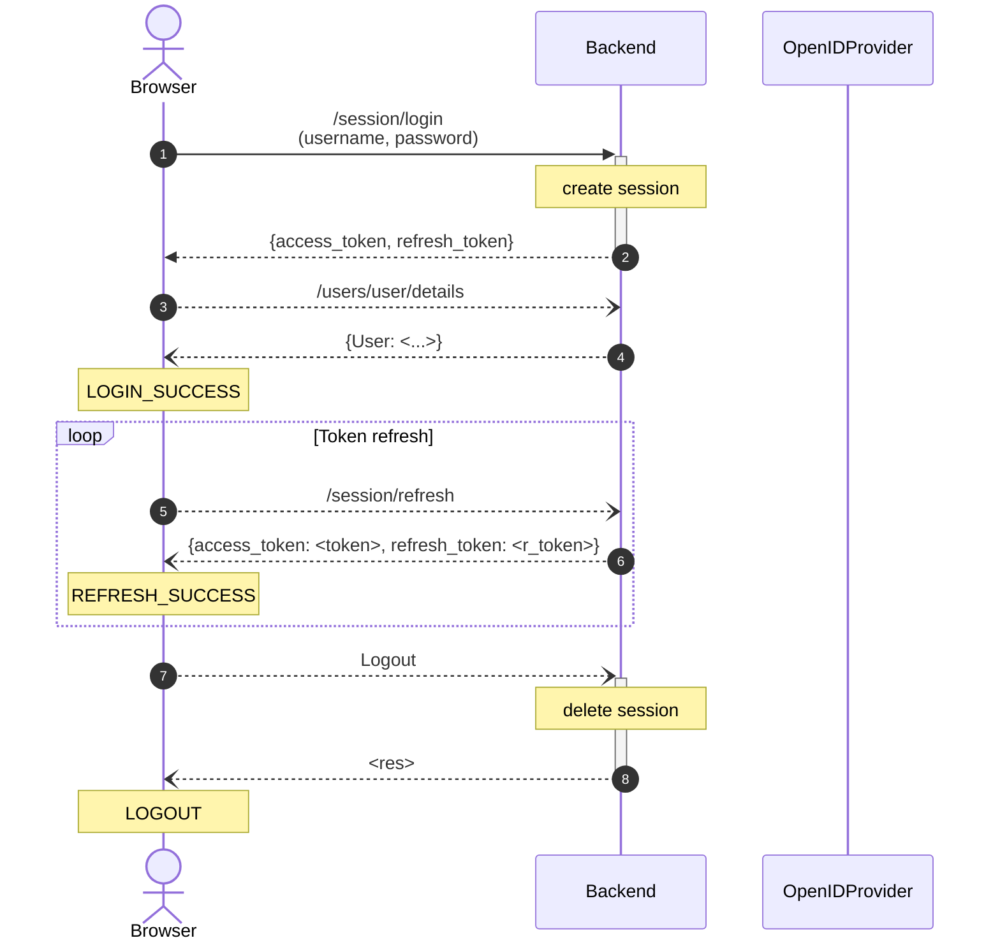
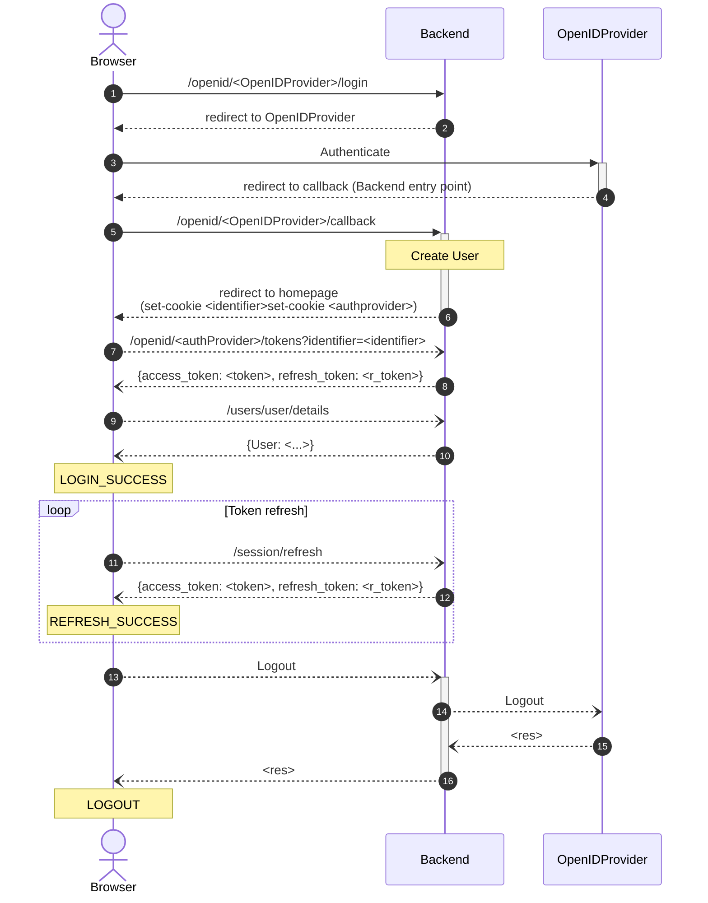

# MapStore Authentication - Implementation Details

In this section you can see the implementation details about the login / logout workflow implemented by MapStore.

## Standard MapStore login

## OpenID MapStore Login

