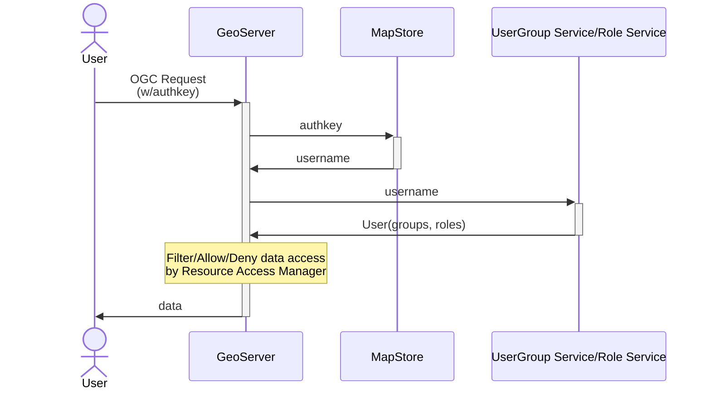

# GeoServer integrations

## MapStore/GeoServer users integration

MapStore can share users, groups an roles with GeoServer. This type of integration allows to setup a fine grained access to the data and the services based on MapStore groups and roles.

This guide explains how to share users, groups and roles between MapStore and GeoServer.
Applying this configurations will allow users logged in MapStore to be recognized by GeoServer. So security rules about restrictions on services, layers and so on can be correctly applied to MapStore users (also using [GeoFence](https://docs.geoserver.org/latest/en/user/extensions/geofence-server/index.html)).



!!! note
    **UserGroup Service/Role Service** can be *MapStore database* or *LDAP* depending on the setup you prefer.

With the suggested implementation the MapStore database will be also a UserGroupService and a RoleService for GeoServer.
This means that every user of MapStore will be also a user in GeoServer, with the same attributes, the same roles (ADMIN, USER) and the same user groups.

For every user-group assigned to a user GeoServer will see also **a role** of the same name, from the role service, assigned to the members of the user-group (as user-group derived roles).

Permission on GeoServer can be assigned using these roles or with more detailed granularity using a custom Resource Access Manager (like [GeoFence](https://docs.geoserver.org/latest/en/user/extensions/geofence-server/index.html)).

## Limits of this solution

This solution partially degradates the functionalities of user management UI of GeoServer (for users, groups and roles that belong to MapStore). If you want to use this solution, you should use the MapStore's user manager and avoid the GeoServer's one.

## Requirements

1. GeoServer must have the [Authkey Plugin Community Module](https://build.geoserver.org/geoserver/main/community-latest/) installed
2. MapStore2 Database must be reachable by GeoServer (H2 will not work, use PostgreSQL or Oracle)
3. MapStore2 must be reachable by GeoServer via HTTP

This example will focus on **PostgreSQL** database type
I am assuming this is a new installation, so no existing user or map will be preserved

!!! Warning
    If you make a mistake in the above procedures and log out, you may not be able to log in again or you may lose your administrator rights. For this reason, it is recommended that you make a backup of your GeoServer data directory before starting the setup. If you encounter any problems, you can restore the backup and start over.

## Database preparation

1. Follow [Geostore wiki](https://github.com/geosolutions-it/geostore/wiki/Building-instructions#building-geostore-with-postgres-support) to setup a postgresql database (ignore the geostore_test part)
2. Start your Tomcat at least once, so `mapstore.war`will be extracted in the `webapps` directory of tomcat instance.
3. Stop Tomcat.
4. Copy from the extracted folder (`<TOMCAT_DIR>/webapps/mapstore`) the file located at `WEB-INF/classes/db-conf/postgres.properties` to replace the file `WEB-INF/classes/geostore-database-ovr.properties`.
5. Edit the new `WEB-INF/classes/geostore-database-ovr.properties` file with your DB URL and credentials.
6. Start Tomcat

### Default user password couples are

- admin:admin
- user:user

## GeoServer Setup

Follow [this guide](https://github.com/geosolutions-it/geostore/tree/master/geoserver)

Create the empty GeoStore database using scripts as described in [GeoStore WIKI](https://github.com/geosolutions-it/geostore/wiki/Building-instructions#building-geostore-with-postgres-support).

The following procedure will make GeoServer accessible to users stored in the MapStore database. In case of the users on MapStore and GeoServer have the same name, the users of MapStore will have precedence. At the end of the procedure, if you access with the user `admin`, you will have to use the password of the `admin` user of MapStore (`admin` by default).

### User Groups and Roles

Steps below reference user, group and role service configuration files, as needed download the files from [the geostore repository](https://github.com/geosolutions-it/geostore/tree/master/geoserver).

#### Setup User Group Service

- In GeoServer, Open the page "Security" --> "User Groups Roles" (from the left menu)
- In the section "User Group Services" click on "add new" to a new user group service
- Select `JDBC`
- name: `geostore`
- Password encryption : `Digest`
- password policy `default`
- Driver `org.postgresql.Driver` (or `JNDI`)
- connection url `jdbc:postgresql://localhost:5432/geostore` (or the one for your setup)
- JNDI only: the JNDI resource name should look like this `java:comp/env/jdbc/geostore`
- set username and password for the db (user `geostore` with password `geostore`)
- click on "Save" button
- Then, in order to adapt the standard JDBC service to MapStore database, you must place the provided files in the new directory (created by GeoServer for this new user group service) inside the data directory at the following path `<gs_datadir>/security/usergroup/geostore`. (`geostore` is the name of the new user group service)
- Then go back to `geostore` user group service page in GeoServer (the `ddl` and `dml` path should have values in them)
- click on "Save" button again

#### Setup Role Service

- In GeoServer Open the page "Security" --> "User Groups Roles" (from the left menu)
- In the section "Role Services" click on "add new" to a new role service
- select `JDBC`
- name `geostore`
- db `org.postgresql.Driver`
- connection url: `jdbc:postgresql://localhost:5432/geostore` (or JNDI, same as above)
- set user and password (user `geostore` with password `geostore`)
- click on "Save" button
- add the provided files to the geostore directory under `/<gs_datadir>/security/role/geostore`
- click on "Save" button again
- go Again in JDBC Role Service `geostore`
- select Administrator role to `ADMIN`
- select Group Administrator Role to `ADMIN`
- click on "Save" button again

### Use these services as default

- In GeoServer "Security" --> "Settings" section (from the left menu)
- Set the **Active role service** to `geostore`
- go to Authentication Section, scroll to Authentication Providers and Add a new one.
- select 'Username Password'
- name it “geostore”
- select “geostore” from the select box
- Save.
- Then go to "Provider chain" and move geostore **on top** in the **right list**.
- Save again

### Use the Auth key Module with GeoStore/GeoServer

These last steps are required to allow users logged in MapStore to be authenticated correctly by GeoServer.

#### Configure GeoServer

- Install the authkey module in GeoServer if needed (most recent versions of GeoServer already include it).
- Go to the authentication page and scroll into the 'Authentication Filters' section
- Click 'Add new'.
- Inside the 'New authentication Filter' page click on authkey module.
- Insert the name (i.e. 'geostore').
- Leave authkey as parameter name.
- Select the  **Web Service** as 'Authentication key user mapper'.
- Select the created geostore's 'User/Group Service'.
- Input the mapstore2 url: `http://<your_hostname>:<mapstore2_port>/mapstore/rest/geostore/session/username/{key}`. Examples:

```text
http://localhost:36728/mapstore/rest/geostore/session/username/{key}
http://localhost/mapstore2/rest/geostore/session/username/{key}
http://mapstore.geosolutionsgroup.com/mapstore/rest/geostore/session/username/{key}
```

- Save.
- Go into the authentication page and open default filter chain.
- Add 'geostore' into the 'Selected' filters and put it on top, and save.

!!! Note
    you should also add the 'geostore' filter into the rest filter chain if you want to use style edition in MapStore.

!!! Note
    in the User Groups and Roles Services available options there are "AuthKEY WebService Body Response - UserGroup Service from WebService Response Body" and "AuthKEY REST - Role service from REST endpoint". Ignore them as they are not supported from MapStore2.

#### Configure MapStore

The last step is to configure MapStore to use the authkey with the configured instance of GeoServer. You can do it by adding to `localConfig.json` like this:

```javascript
//...
"useAuthenticationRules": true,
  "authenticationRules": [{
    "urlPattern": ".*geostore.*",
    "method": "bearer"
  }, {
    "urlPattern": "\\/geoserver/.*",
    "authkeyParamName": "authkey",
    "method": "authkey"
  }],
//...
```

- Verify that "useAuthenticationRules" is set to `true`
- `authenticationRules` array should contain 2 rules:
       - The first rule should already be present, and defines the authentication method used internally in mapstore
       - The second rule (the one you need to add) should be added and defines how to authenticate to GeoServer:
         - `urlPattern`: is a regular expression that identifies the request url where to apply the rule
         - `method`: set it to `authkey` to use the authentication filter you just created in Geoserver.
         - `authkeyParamName`: is the name of the authkey parameter defined in GeoServer (set to `authkey` by default)

### Advantages of user integration

Integrating the user/groups database with GeoServer you can allow some users to:

- Execute some processes (via [WPS security](https://docs.geoserver.org/stable/en/user/services/wps/security.html))

- Download data (setting up the WPS download extension to allow/deny certain users to download data)

- Edit Styles (by default allowed only to administrators, but you can change it acting on `/rest/` Filter Chains).

- Access to layers based on users (using the standard GeoServer security)

- Filter layers data based on users (GeoFence), see [here](https://docs.geoserver.org/latest/en/user/extensions/geofence-server/index.html)

- Allow editing of layers to certain MapStore users ([GeoServer Security](https://docs.geoserver.org/stable/en/user/security/webadmin/data.html)). The editing can be enabled in the [plugin settings of MapStore](https://dev-mapstore.geosolutionsgroup.com/mapstore/docs/api/plugins#plugins.FeatureEditor)

## GeoServer Plugins and Extensions

MapStore supports several plugins for GeoServer. Installing them will expand the functionalities of MapStore, allowing to navigate data with time dimension, styling layers and so on.

Here a list of the extensions that MapStore can use:

- [WMTS Multidimensional](https://docs.geoserver.org/stable/en/user/extensions/wmts-multidimensional/index.html) despite the name, this service provides multidimensional discovery services for GeoServer in general, not only for WMTS, and it is **required** to use the timeline plugin of MapStore.

- [SLD Rest Service](https://docs.geoserver.org/stable/en/user/extensions/sldservice/index.html): this extension can be used by the MapStore styler to classify Vector and Raster data. It can inspect the real layer data to apply classification based on values contained in it. It allows to select various classification types (quantile, equalInterval, standardDeviation…) and to customize the color scales based on parameters

- [CSS Extension](https://docs.geoserver.org/stable/en/user/styling/css/install.html): with this extension the MapStore styler allows to edit styles also in CSS format, in addition to the standard SLD format

- [WPS Extension](https://docs.geoserver.org/stable/en/user/services/wps/install.html): provides several process that can be executed using the OGC WPS Standard. IT contains some default services very useful for MapStore:
       - **gs:PagedUnique**: provide a way to query layer attribute values with pagination and filtering by unique values. It enables autocomplete of attribute values for feature grid, attribute table, filter layer and other plugins.
       - **gs:Aggregate**: allows aggregation operation on vector layers. This can be used  by the charts (widgets, dashboards) to catch data
       - **gs:Bounds**: allows to calculate bounds of a filtered layer, used to dynamically zoom in dashboards map, when filtering is active.
       - **geo:buffer**: provide a way to create a new vector layer around the source layer. This is mandatory for the [*GeoProcessing*](https://docs.mapstore.geosolutionsgroup.com/en/latest/user-guide/geoprocessing-tool/) plugin buffer option.
       - **gs:IntersectionFeatureCollection**: allows to return the intersection between two feature collections adding the attributes from both of them. This is mandatory for the [*GeoProcessing*](https://docs.mapstore.geosolutionsgroup.com/en/latest/user-guide/geoprocessing-tool/) plugin intersection option.
       - **gs:CollectGeometries**: allows to collect all the default geometries in a feature collection and returns them as a single geometry collection. This can be used by the [*GeoProcessing*](https://docs.mapstore.geosolutionsgroup.com/en/latest/user-guide/geoprocessing-tool/) plugin to create a new layer.

- [WPS download community module](https://docs.geoserver.org/stable/en/user/extensions/wps-download/index.html): this additional module allows to improve the exporter plugin, based by default only on the WFS, providing asynchronous download capabilities.
The advanced Download, activated when GeoServer provides the WPS service above, allows to
       - Download also the raster data
       - Schedule download processes in a download list (and download them later, when post processing is finished).
       - Select Spatial reference system
       - Crop dataset to current viewport
       - For vector layers:
           - Filter the dataset (based on MapStore filter)
       - For raster layers:
           - Select Compression type and quality
           - Define width and height of internal tiles

- [CSW Extension](https://docs.geoserver.org/latest/en/user/services/csw/installing.html): activating this extension, MapStore can browse data of GeoServer using the CSW protocol, improving performances with paginated requests. This is particularly useful when a GeoServer instance contains hundreds or thousands of layers, so the output of the WMS capabilities services can be too slow.

- [Query Layer Plugin](https://docs.geoserver.org/stable/en/user/extensions/querylayer/index.html#installing-the-querylayer-module): this plugin allows the possibility to do cross-layer filtering. Cross layer filtering is the mechanism of filtering a layer using geometries coming from another layer. The plugin allows this filtering to be performed on the server side in an efficient way.

- [DDS/BIL Plugin](https://docs.geoserver.org/stable/en/user/community/dds/index.html): this plugin add to geoserver the possibility to publish raster data in DDS/BIL format (World Wind). This particular plugin is useful if we want to use a raster data as elevation model for MapStore. This elevation model will be used in 3D mode or with the mouse coordinates plugin (displaying the elevation of a point on the map, together with the coordinates).

- [WPS longitudinal profile process](https://docs.geoserver.org/stable/en/user/community/wps-longitudinal-profile/index.html): this plugin added to geoserver gives the possibility to calculate an altitude profile on a given path  and it is required to use the [*Longitudinal Profile*](https://docs.mapstore.geosolutionsgroup.com/en/latest/user-guide/longitudinal-profile/) plugin of MapStore.

- [WFS FreeMarker Extension](https://docs.geoserver.org/stable/en/user/community/wfs-freemarker/index.html): this plugin add to GeoServer the possibility to generate an HTML output for a WFS GetFeature response. As for the WMS Identify settings, it is applicable in MapStore by selecting the HTML format in the [*Feature Info Form*](https://docs.mapstore.geosolutionsgroup.com/en/latest/user-guide/layer-settings/#feature-info-form) for the *Identify Tool*.
