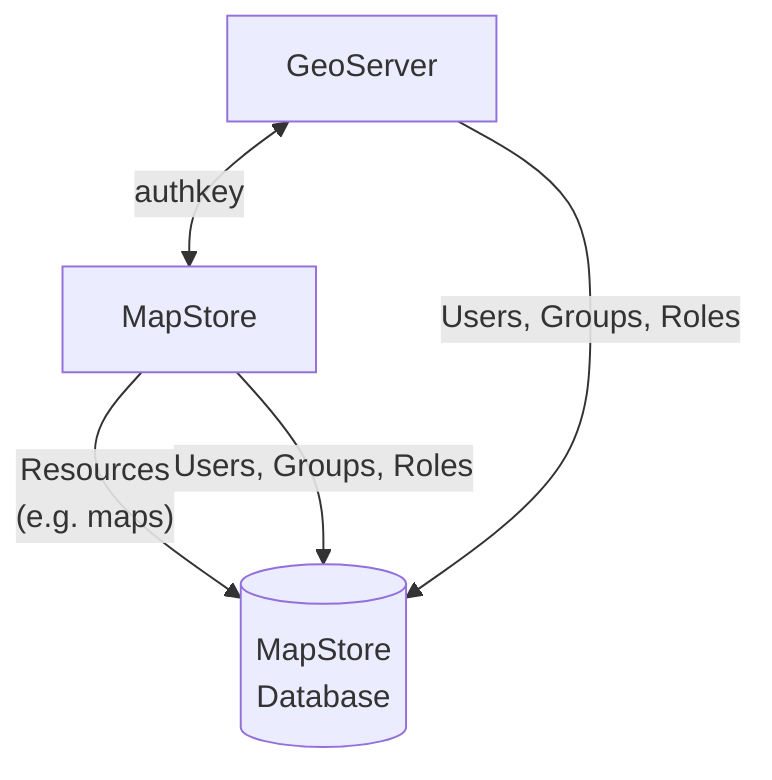
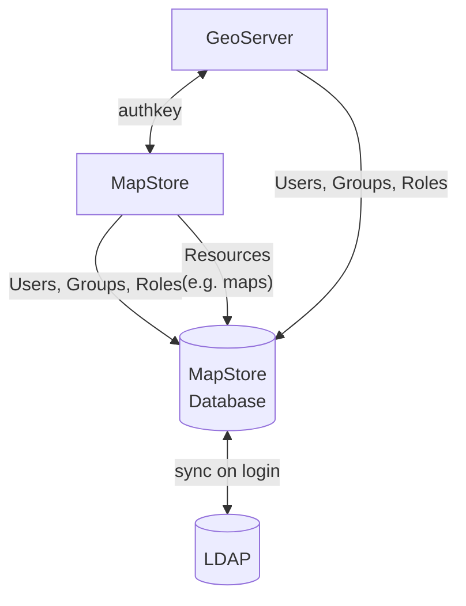
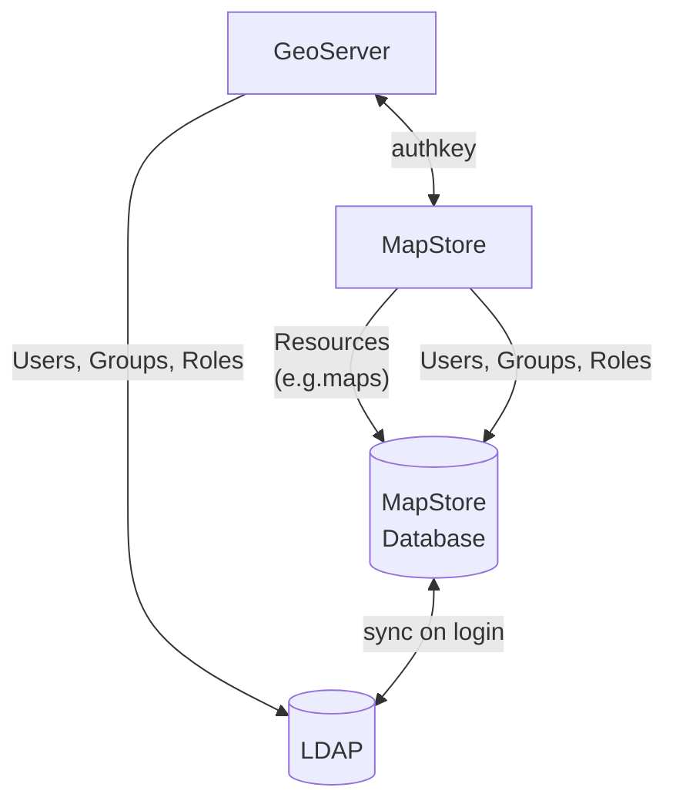
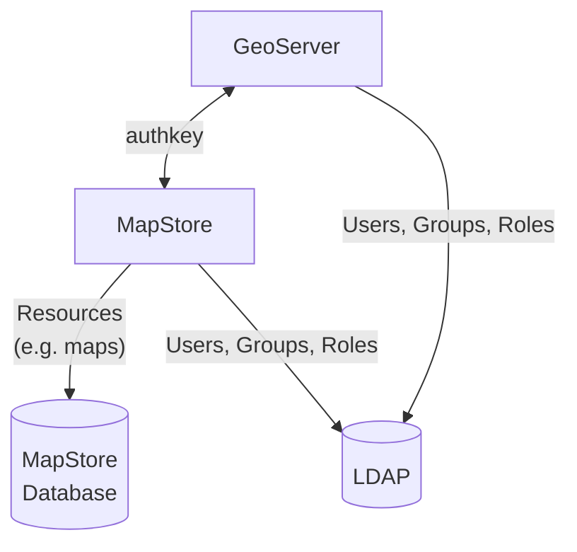

# Possible setups

Accordingly with your infrastructure, there are several setups you can imagine with MapStore and GeoServer.

## MapStore-GeoServer integration

## MapStore-LDAP + MapStore-GeoServer

## MapStore-GeoServer + MapStore-LDAP + GeoServer-LDAP

## MapStore-GeoServer + MapStore-LDAP (direct) + GeoServer-LDAP

