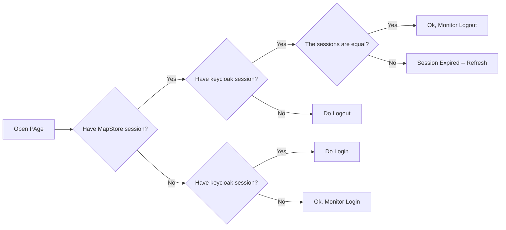
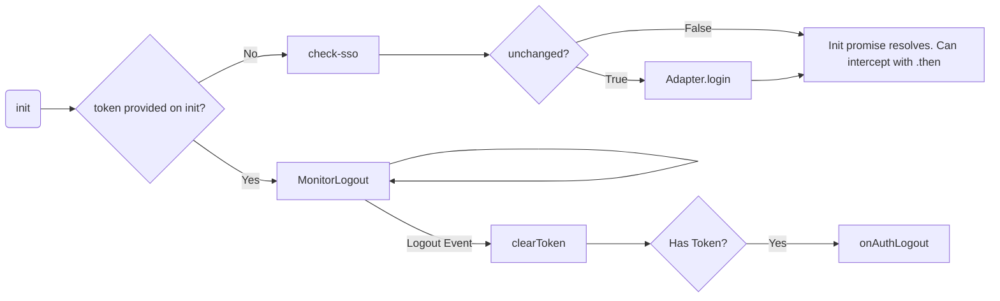
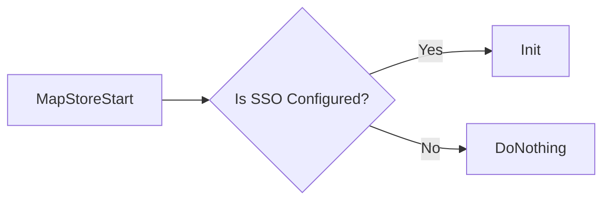
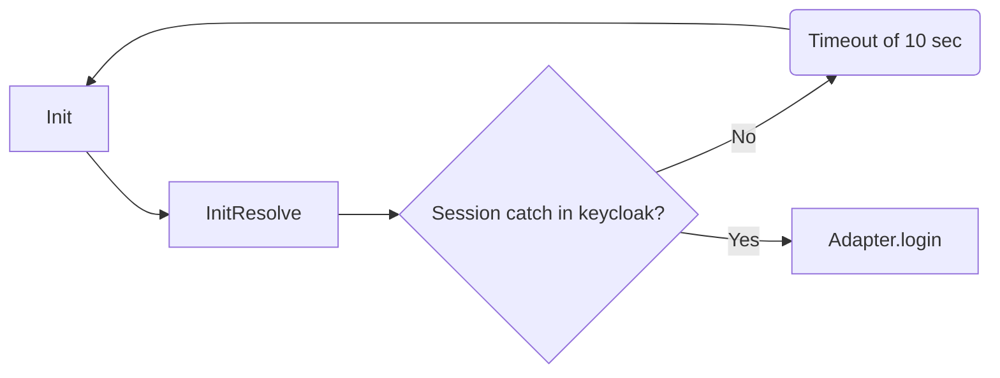
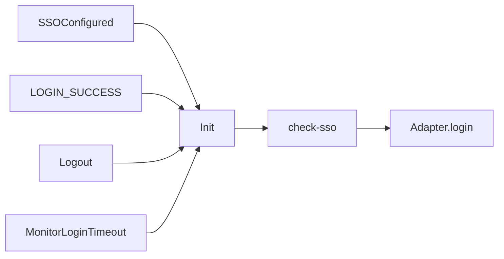

# SSO Workflow in Keycloak

If keycloak SSO is configured, we want to implement the following workflow.
!!! note
    Provides some charts in `mermaidJS` that can be inspected from GitHub UI.

The keycloak library implements the following workflow

!!! note
    `unchanged` is the variable emitted by the `check-sso` operation.

!!! note
    After OpenIDLogin token and refreshToken are not set yet in keycloak --> then  Adapter.doLogin does nothing. TODO: check if possible to intercept token set from epic, then re-init keycloak lib.

MapStore can:

- Re-run `init`
- Intercept `onAuthLogout`
- Implement adapter methods `login`, `logout`.
- Intercept `init` promise resolve with `.then`

For this reason, to implement auto-login in MapStore, we apply the following workflow.

## Initialization

At the initial page load, we check if the `authenticationProviders` contains a `sso` entry (only keycloak)

`Init` is initialized by MapStore with the current MapStore `access_token` and `refresh_token`, if present.

## Case 1 - Monitor Login from keycloak

If MapStore is not logged in, the `init` function do a `check-sso` operation and finish.
In order to monitor the login on MapStore, we implemented a timer to re-init trigger anytime the `check-sso` resolves with not authenticated.

!!! note
   Using `messageReceiveTimeout` as timeout, the same timeout of the keycloak JS library for monitoring logout

## Case 2 - Sync Tokens

If MapStore user is logged in, the `init`, we may not initially have the token ready.
For this reason, on LOGIN_SUCCESS, we re-init the application.

## Case 3 - Monitor Logout from keycloak

In this case the library that receives a valid keycloak token monitors the logout autonomously.

## Case 4 - Logout from MapStore

Logout from MapStore, a bug in keycloak API doesn't correctly check the internal iframe, and there is no possibility to trigger it, until you visit the keycloak page.
This condition after logout can not be distinguished from a external login (from keycloak) detection.
In order to avoid this, an hack is necessary. MapStore loads an iframe immediately after logout to allow the cookie session to be catch and to apply the proper reset.

## Case 5 - Refresh token

By default keycloak has 5 minutes long lifetime for token, 30 minutes for refresh token.
Anyway this can be configured. For this reason, the keycloak support schedules a refresh based on the current token expiration, scheduling a refresh in half time between expiring time and now. (e.g The token expires 2 minutes from now, a refresh is scheduled in 1 minute).
