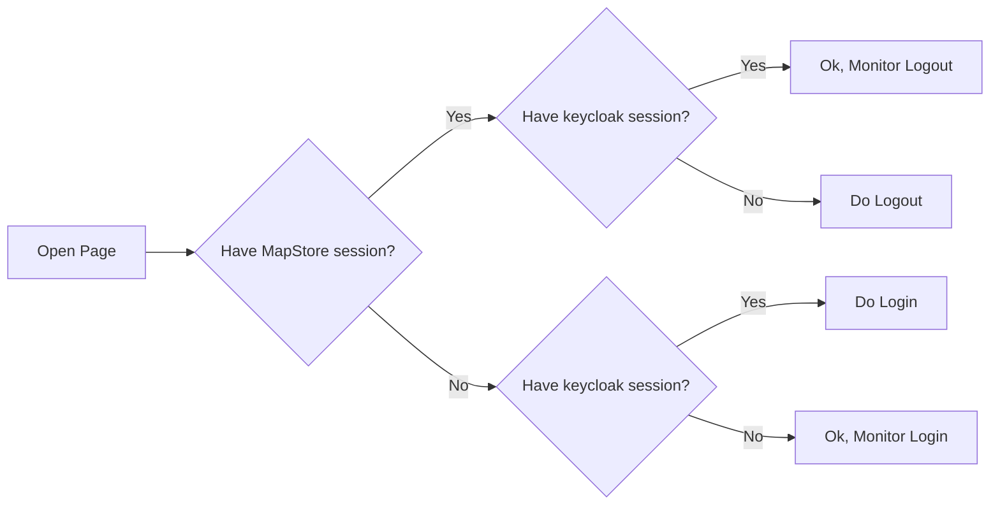
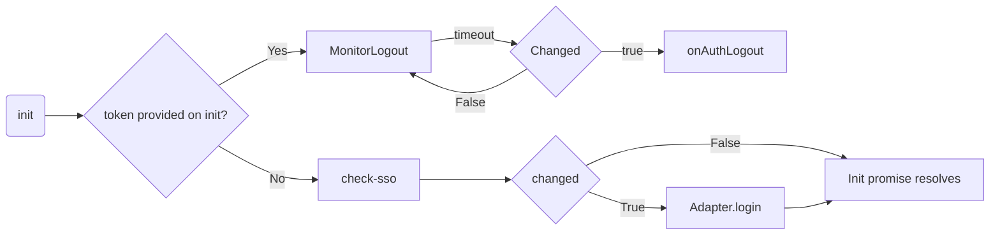
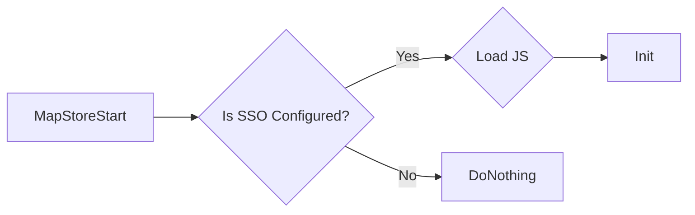
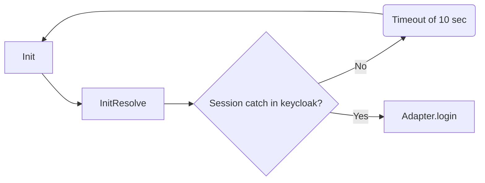

# SSO Workflow in Keycloak

Here in this section some details about keycloak SSO integration

## Desired workflow

If keycloak SSO is configured, we want to implement the following workflow.

The keycloakJS library implements the following workflow:

MapStore can:

- Re-run `init`
- Intercept `onAuthLogout`
- Implement adapter methods `login`, `logout`.
- Intercept `init` promise resolve with `.then`

!!! note
    `changed` is the variable emitted by an internal iframe managed by the keycloak JS API.
    This technique allows to intercept logout events, anyway refreshing tokens or intercepting login, after first attempt
    doesn't seem to work well and has some limitations because of security reasons.
    In particular in the current implementation with `openID` sync with GeoStore we need to
    workaround partially the logic of the library to make the tokens work in sync.

## Implementation

The SSO integration in MapStore will reuse the entry points of the JS lib together with the existing openID integration in keycloak, implementing the following workflows:

### Initialization

At the initial page load, we check if the `authenticationProviders` contains a `sso` entry (only keycloak)

- `LoadJS`: loads `keycloak.js`, that includes the JS support to keycloak, from keycloak instance (only once)
- `Init` is initialized by MapStore with the current config, adding MapStore's `access_token` and `refresh_token`, if present, from openID login.

### Monitoring phase

After initialization, we may receive different events or cases. These are the possible cases:

#### Case 1 - Login From MapStore

If MapStore is not logged in, the user can click on login button and be redirected to keycloak login form.
After that, the init flow will pass the MapStore tokens to the JS interface. They will be used to check session logout.

!!! note
    If MapStore user is logged in, the `init`, we may not initially have the token ready. For this reason, on LOGIN_SUCCESS, we re-init the application,
    or sync operation is triggered from `Adapter.login` to refresh the tokens.

#### Case 2 - Login from keycloak

If MapStore is not logged in, the `init` function do a `check-sso` operation and finish.
In order to monitor the login on MapStore, we implemented a timer to re-init trigger anytime the `check-sso` resolves with not authenticated.

!!! note
   Implementation is using `messageReceiveTimeout` as timeout, the same timeout variable of the keycloak JS library for monitoring logout

#### Case 3 - Logout from keycloak

In this case the library that receives a valid keycloak token monitors the logout autonomously.

#### Case 4 - Logout from MapStore

Logout from MapStore, a bug in keycloak API doesn't correctly check the internal iframe (`changed` option event), and there is no possibility to trigger it, until you visit the keycloak page.
This condition after logout can not be distinguished from a external login (from keycloak) detection. So refreshing the page before the token on client is naturally expired will cause a redirect to
Login page, because MapStore find there is an active session on keycloak.
In order to avoid this, an hack is necessary. MapStore loads an iframe immediately after logout to allow the cookie session to be catch and to apply the proper reset.

### Refresh token

By default keycloak has 5 minutes long lifetime for token, 30 minutes for refresh token.
Anyway this can be configured. For this reason, the keycloak support schedules a refresh based on the current token expiration, restarting from `init`, scheduling a refresh as half of time between expiring time and now. (e.g The token expires 2 minutes from now, a refresh is scheduled in 1 minute).
