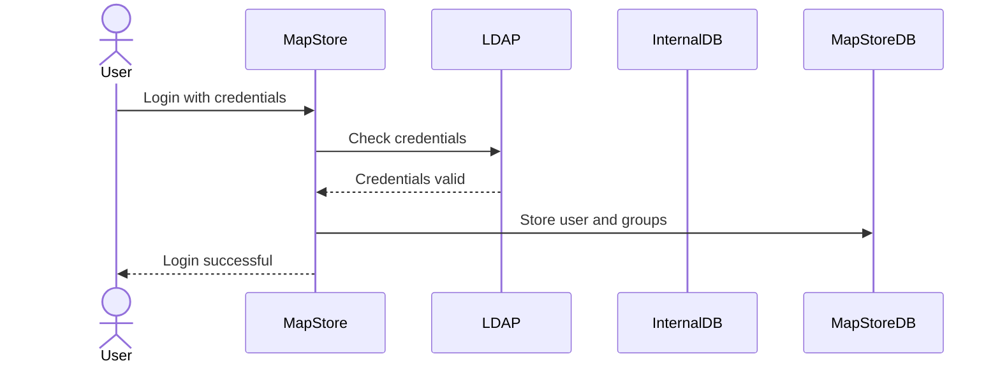
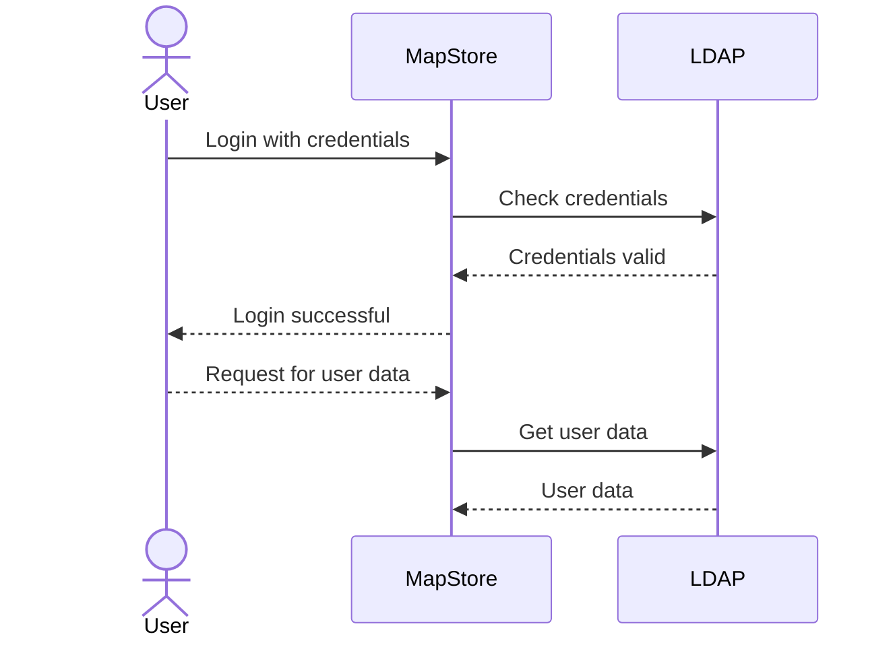

# LDAP integration with MapStore

The purpose of this guide is to explain how to configure MapStore to use an LDAP repository for authentication and accounting (users, roles and user-groups) instead of the standard database.

## Overview

By default the MapStore backend users service (also known as [GeoStore](https://github.com/geosolutions-it/geostore)), uses a relational database to store and fetch users details, implement authentication and assign resource access rights to users and groups (for maps, dashboards, etc.).

If you want users to log in using their LDAP/AD credentials, you can configure MapStore to connect to your LDAP/AD service. In this setup, the relational database will only store resources and accessory data (permissions, attributes, etc.) related to the users from your LDAP/AD service.

Note that the LDAP storage is read-only. This means the MapStore User/Groups management UI cannot be used to manage users and groups. This is because an LDAP repository is considered an external source and should be managed externally.

If this causes confusion, you can disable the UI when using LDAP by removing the corresponding plugin from the MapStore configuration in `localConfig.json`.

The LDAP storage can be configured in two ways:

* *Synchronized* mode
* *Direct connection* mode (experimental)

### Synchronized mode

In *synchronized mode*, user data (users, groups, roles) is read from LDAP on every login and copied on the internal database.

Any other operation, for example getting user permissions on maps, always uses the internal database.

Synchronized mode is faster for normal use, but data may dis-align when users are removed from the LDAP repository.

In general we suggest to use synchronized mode, since it is the most stable and tested one.



### Direct connection mode (experimental)

In direct connection mode, user data is always read from LDAP, for any operation, so there is no risk of misaligned data.

Direct connection approach is simpler and avoids most the synchronized mode defects (e.g. misalignments).



## Building MapStore with LDAP support

By default, MapStore is built without LDAP support. To enable LDAP support, you have to properly build the application with the LDAP profile enabled, or include the LDAP configuration in your project.

### MapStore main product

MapStore can be built with LDAP support by invoking the build with the `ldap` profile.

```bash
./build.sh <version> ldap
```

### MapStore project

If you are using MapStore in a project, you will have to add to your `geostore-spring-security.xml` file in the `src/main/resources`.

You can copy and enable `MapStore2/product/config/ldap/geostore-spring-security-ldap.xml` from MapStore, and customize it.

## Configuring

Once your application includes the proper `geostore-spring-security.xml` that involves ldap, you can confiure ldap properties in the `ldap.properties` file that you can place in the `data-dir`. In your project you can include the `ldap.properties` file in the `src/main/resources` folder, together with the `geostore-spring-security.xml`, to have your default configuration in the final build. You can still use `ldap.properties` in the `data-dir` to override the default configuration (e.g. for production, inserting credentials and LDAP url).

### Configuration properties

Configurable properties in the `ldap.properties` file include the following:

* `ldap.host`: the LDAP server host
* `ldap.port`: the LDAP server port
* `ldap.root`: the **baseDN** of the LDAP tree. This is the root path for all the searches
* `ldap.userDn`: the complete DN of an LDAP user, with browse permissions on the used LDAP tree (optional, if browse is available to anonymous users)
* `ldap.password`: the password of the userDn LDAP user (optional, if browse is available to anonymous users)
* `ldap.userBase`: the root path for searching users. Can be empty.
* `ldap.groupBase`: the root path for searching groups.Can be empty.
* `ldap.roleBase`: the root path for searching roles. Can be empty.
* `ldap.userFilter`: the LDAP filter used to search for a given username ({0} is the username the user will insert in login form). This, depending on the LDAP schema, can be the user's `uid`, `cn`, `mail`, `sAMAccountName`, `userPrincipalName`, etc.
* `ldap.groupFilter`: the LDAP filter used to search for groups membership of a given user ({0} is the full user DN).
* `ldap.roleFilter`: the LDAP filter used to search for role membership of a given user ({0} is the full user DN)
* `ldap.hierachicalGroups`: enables / disables support for nested (hierarchical) groups; when true, a user is assigned groups recursively if its groups belong to other groups
* `ldap.nestedGroupFilter`: the LDAP filter used to search for groups membership of a given group ({0} is the full group DN)
* `ldap.nestedGroupLevels`: the max number of nested groups that are used
* `ldap.searchSubtree`: if true, all the searches are recursive from the relative root path
* `ldap.convertToUpperCase`: if true, all users, groups and roles names are transformed to uppercase in MapStore.

Here a sample `ldap.properties` file:

```properties
ldap.host=localhost
ldap.port=10389
ldap.userDn=
ldap.password=
ldap.root=dc=acme,dc=org

ldap.userBase=ou=people
ldap.groupBase=ou=groups
ldap.roleBase=ou=groups
ldap.userFilter=(uid={0})
ldap.groupFilter=(member={0})
ldap.roleFilter=(member={0})

ldap.hierachicalGroups=false
ldap.nestedGroupFilter=(member={0})
ldap.nestedGroupLevels=3

ldap.searchSubtree=true
ldap.convertToUpperCase=true
```

### Assigning roles

In the `ldap.properties` you can setup how to assign roles to various users and groups.
MapStore has only two roles: `USER` and `ADMIN`. The default `geostore-spring-security-ldap.xml`, included in MapStore using the `ldap` profile, will look for the `ROLE_ADMIN` in the LDAP sub-tree filtered by the `ldap.roleFilter` property.
If the user belongs to this group, it is assigned the ADMIN role, otherwise the USER role.

From the `geostore-spring-security-ldap.xml` you can customize the role assignment by editing some special `ldap.properties` file.

* `ldap.rolePrefix` is the prefix used for the roles in the LDAP tree. By default it is `ROLE_`.
* `ldap.adminRole` is the role name that assigns the ADMIN role. By default it is `ROLE_ADMIN`.

Here a sample `ldap.properties` extract that will look for the `MAPSTORE_ROLE_ADMIN` role in the LDAP tree to assign the ADMIN role:

```properties
ldap.rolePrefix=MAPSTORE_ROLE_
ldap.adminRole=MAPSTORE_ROLE_ADMIN
```

In previous version this required to edit `geostore-spring-security-ldap.xml` file, by editing `rolePrefix` and adding `authoritiesMapper` property bean to the `GeoStoreLdapAuthoritiesPopulator` bean.

### Assigning groups

In the `ldap.properties` the properties `ldap.groupBase` and `ldap.groupFilter` are used to search for groups the user belongs to. The `ldap.groupFilter` is used to search for groups the user belongs to. All the groups found are assigned to the user. Using the synchronized mode, the groups are updated in the internal database on every login.

If `ldap.hierachicalGroups` is set to `true`, the groups are assigned recursively, if they belong to other groups. The `ldap.nestedGroupFilter` and `ldap.nestedGroupLevels` properties are used to search for nested groups.

### Enabling direct connection mode

The default configuration enables the synchronized mode. To switch to direct connection mode you have to manually edit the final `geostore-spring-security.xml` to uncomment the related section at the end of the file:

```xml
<!-- enable direct connection mode -->
<bean id="ldapUserDAO" [...]>
        [...]
    </bean>
    <bean id="ldapUserGroupDAO" [...]>
        [...]
    </bean>
    <!-- -->
```

In the direct mode, all the users and groups are read from LDAP, replacing the internal database of users and groups. In this case, the properties involved are:

* `ldap.userBase`: the root path for searching users. Can be empty.
* `ldap.groupBase`: the root path for searching groups. Can be empty.
* `ldap.memberPattern`: a regular expression to match the user's DN in the group's `member` attribute. By default it is `^uid=([^,]+).*$`. This is used to extract the user's `uid` from the `member` attribute of the group.

Other properties are still to be configured in `geostore-spring-security.xml` file.

## Testing LDAP support

If you don't have an LDAP repository available, a very light solution for testing is the `acme-ldap` java server included in the GeoServer LDAP documentation.

* Implementation: [here](https://github.com/geoserver/geoserver/blob/master/doc/en/user/source/security/tutorials/ldap/acme-ldap/src/main/java/org/acme/Ldap.java)
* Documentation: [here](https://docs.geoserver.org/latest/en/user/security/tutorials/ldap/index.html).
* Download link: [download](https://geoserver.org/acme-ldap/acme-ldap-1.0.jar) the jar file.

Here a sample `ldap.properties` file to connect to the acme-ldap server:

```properties
ldap.host=localhost
## port of the LDAP server acme-ldap
ldap.port=10389
ldap.root=uid=bill,ou=people,dc=acme,dc=org
ldap.userDn=hello
ldap.password=secret
ldap.userBase=ou=people
ldap.groupBase=ou=groups
ldap.roleBase=ou=groups
ldap.userFilter=(uid={0})
ldap.groupFilter=(member={0})
ldap.roleFilter=(member={0})
ldap.hierachicalGroups=false
ldap.nestedGroupFilter=(member={0})
ldap.nestedGroupLevels=3
ldap.searchSubtree=true
ldap.convertToUpperCase=true
ldap.rolePrefix=admin
ldap.adminRole=admin
```

The users in the acme-ldap are:

* `bill` with password `hello` with ADMIN role
* `bob` with password `secret` with USER role
* `alice` with password `foobar` with USER role

You can easily customize the sample data tree by editing the java code and recompiling the jar.

## LDAP configuration Troubleshooting

### Limiting login to a subset of users

If you want to limit the login to a subset of users, you can use the `ldap.userFilter` property to filter the users that can login, adding a condition to the filter.

example:

```properties
ldap.userFilter=(&(uid={0})(memberOf=cn=mapstore-users,ou=groups,dc=acme,dc=org))
```

### Using a different attribute for login

If you want to use a different attribute for login, you can change the `ldap.userFilter` property to use a different attribute.

example:

```properties
ldap.userFilter=(userPrincipalName={0})
```

### Debugging LDAP connection

If you have problems with the LDAP connection, you can enable the debug log for the LDAP connection in the `log4j2.properties` file.

Here a sample configuration:

```properties
rootLogger.level = DEBUG
appenders= console, file


appender.console.type = Console
appender.console.name = LogToConsole
appender.console.layout.type = PatternLayout
appender.console.layout.pattern = %p %d{yyyy-MM-dd HH:mm:ss.SSS} %c::%M:%L - %m%n
rootLogger.appenderRef.stdout.ref = LogToConsole
rootLogger.appenderRef.console.ref = LogToConsole

appender.file.type = File
appender.file.name = LogToFile
appender.file.fileName=${sys:catalina.base}/logs/mapstore.log
appender.file.layout.type=PatternLayout
appender.file.layout.pattern=%p   %d{yyyy-MM-dd HH:mm:ss.SSS}   %C{1}.%M() - %m %n
rootLogger.appenderRef.file.ref = LogToFile


logger.restsrv.name=org.springframework.security.ldap
logger.restsrv.level=  DEBUG
logger.hibernate1.name=org.hibernate
logger.hibernate1.level=INFO
logger.trg1.name=com.trg
logger.trg1.level=INFO
```

## Advanced Configuration

LDAP and Active Directory provide a lot of use cases that may not be covered by the default configuration. In this case, in a MapStore custom project, you can customize the LDAP configuration in the `geostore-spring-security.xml` file, introducing custom beans and properties.

More information about the MapStore backend storage and security service, GeoStore, is available [here](https://github.com/geosolutions-it/geostore).

In particular, more information about LDAP usage with GeoStore is in the following [Wiki page](https://github.com/geosolutions-it/geostore/wiki/LDAP-Authentication).
