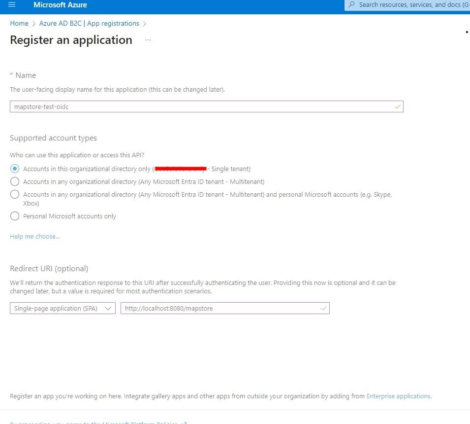
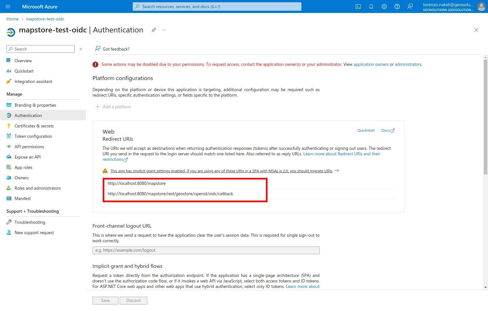
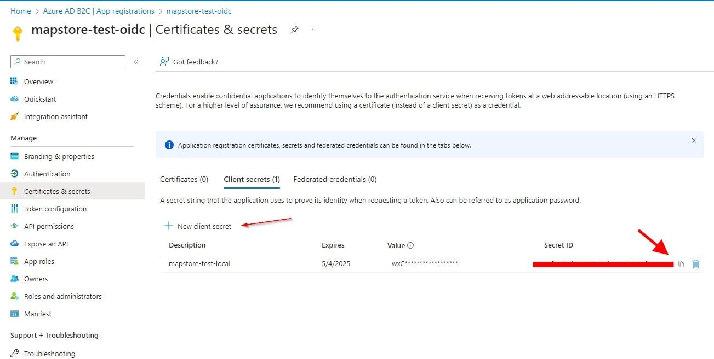
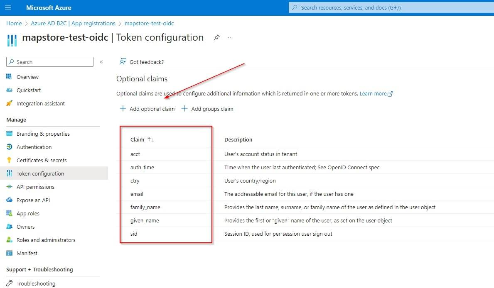
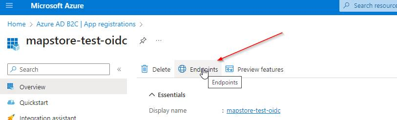

# Integration with OpenID connect

MapStore allows to integrate with [OpenID connect](https://openid.net/connect/) services. This allows to use external services to authenticate users in MapStore. This is useful when you have to integrate MapStore with an existing authentication system, or when you want to use a third-party service to authenticate users.

## Customizing logo an text in Login Form

For details about the configuration for a specific service, please refer to the corresponding section below. If you want to customize the icon and/or text displayed, you can refer to the documentation of the [LoginPlugin](https://mapstore.geosolutionsgroup.com/mapstore/docs/api/plugins#plugins.Login).

By default, the `authenticationProviders` field contains only `{"type": "basic", "provider": "geostore"}`, which represents the standard login on **MapStore** using a username and password. With this default configuration, when a user tries to log in, MapStore will display the classic login form.

You can add additional providers to the list (e.g., `openid`), and they will be included as options in the login window. If you want to remove the login form and only use the added providers, you can remove the `geostore` entry from the `authenticationProviders` list.

!!! info
    If only one OpenID entry is present in `authenticationProviders` (and no `geostore` entry available), clicking on the login entry in the login menu will redirect directly to the OpenID provider login page configured, without showing the login window. If more than one entry is present in the `authenticationProviders` list, the the login window will be provided in the MapStore UI to be able choose the desired one for the authentication.

## Supported OpenID services

MapStore provides a generic OpenID connect provider (`oidc`) that can be used to configure any OpenID Connect service (Google, Microsoft, Keycloak, Facebook, Github, etc.). In addition, MapStore provides specific configurations for some services. This means that you can configure MapStore to use the following services out of the box:

- OpenID connect
- Google (specific)
- Keycloak (specific)

For each service you want to include, you have to:

- configure the service (e.g., create a new application on Google Console, create a new client on Keycloak, etc.)
- properly configure the backend (in `mapstore-ovr.properties`)
- modify the `localConfig.json` file by adding a proper entry to the `authenticationProviders`

Moreover the keycloak provider allows to configure advanced features like the **Single Sign On (SSO)** with other applications and **direct user database integration** as for [LDAP](ldap.md#ldap-integration-with-mapstore).

!!! note
    For the moment the generic `oidc` provider does not support multiple instances. This means that you can configure only **one** generic `oidc` provider. You can configure the specific providers (e.g., `google`, `keycloak`) in addition to the generic `oidc` provider, but not multiple instances of the generic `oidc` provider. So for instance you can configure a generic `oidc` provider (e.g. connected to Github) plus a `google` and a `keycloak` provider, but not two generic `oidc` providers.

### OpenID connect (experimental)

In order to configure the generic OpenID provider with a service of your choice you have to:

- Configure the OpenID provider client
- Configure MapStore back-end
- Configure the MapStore front-end

#### Configure OpenID provider client

This step depends on the specific OpenID provider so, please, refer to the specific documentation of the OpenID provider you are using. You can find some examples about how to configure a generic OpenID provider with Microsoft Azure in the following sections. The same information are valid for other OpenID providers, like Google, Keycloak, etc.
You have to get the following information:

- **Client ID**: the client id. This is the client id that must be present on the OpenID provider
- **Client Secret**: the client secret. This is the client secret for the client id on the OpenID provider
- **Discovery URL**: the discovery URL. This is the URL that contains all the information for the specific service.

#### Configure the MapStore back-end

In order to configure the generic OpenID provider you have to:

- create/edit `mapstore-ovr.properties` file (in data-dir or class path) to configure the generic provider this way:

```properties
# enables the keycloak OpenID Connect filter
oidcOAuth2Config.enabled=true

# note: this is the client id have to be present on the OpenID provider
oidcOAuth2Config.clientId=mapstore-server
oidcOAuth2Config.clientSecret=<THE_CLIENT_SECRET>
# the discovery URL
oidcOAuth2Config.discoveryUrl=http://keycloak:8080/auth/realms/mapstore/.well-known/openid-configuration
oidcOAuth2Config.sendClientSecret=true
# create the user if not present
oidcOAuth2Config.autoCreateUser=true
oidcOAuth2Config.redirectUri=http://localhost:8080/mapstore/rest/geostore/openid/oidc/callback
# Internal redirect URI (you can set it to relative path like this `../../..` to make this config work across domain)
oidcOAuth2Config.internalRedirectUri=http://localhost:8080/mapstore
# user name attribute (default is `email`)
# oidcOAuth2Config.principalKey=email
# Optional role claims, if a claim contains roles, you can map them to MapStore roles. (roles can be only ADMIN or USER)
# oidcOAuth2Config.rolesClaim=roles
# Optional group claims, if a claim contains groups, you can map them to MapStore groups.
# oidcOAuth2Config.groupsClaim=groups
# Enables global logout from SSO, if properly confugred. false by default
# oidcOAuth2Config.globalLogoutEnabled=true
# Optional scopes parameter, that allows to customize the scopes to reqeuest. If empty, MapStore will use the one present in the discovery document
# oidcOAuth2Config.scopes=email,profile

```

- `oidcOAuth2Config.clientId`: the client id. This is the client id that must be present on the OpenID provider
- `oidcOAuth2Config.clientSecret`: the client secret. This is the client secret for the client id on the OpenID provider
- `oidcOAuth2Config.discoveryUrl`: the discovery URL. This is the URL that contains all the information for the specific service.
- `oidcOAuth2Config.sendClientSecret`: if `true`, the client secret will be sent to the OpenID provider. If `false`, the client secret will not be sent.
- `oidcOAuth2Config.autoCreateUser`: if `true`, the user will be created, if not present, in the MapStore database. If `false`, the user will not be created (useful if the user is managed by an external service like Keycloak or LDAP).
- `oidcOAuth2Config.redirectUri`: the redirect URI. This is the URI that the OpenID provider, and it must be the effective URI of the MapStore application, with the path `/rest/geostore/openid/oidc/callback`.
- `oidcOAuth2Config.internalRedirectUri`: the internal redirect URI. This is the URI that the MapStore will redirect to after the login. It must be the effective URI of the MapStore application.
- `oidcOAuth2Config.principalKey`: (*optional*) the user name attribute. This is the attribute that will be used as user name. The default is `email`.
- `oidcOAuth2Config.rolesClaim`: (*optional*) the role claims. If a claim contains roles, you can map them to MapStore roles. The roles can be only `ADMIN` or `USER`. If the claim is not present, the default role will be `USER`.
- `oidcOAuth2Config.groupsClaim`: (*optional*) the group claims. If a claim contains groups, you can map them to MapStore groups. If the claim is not present, no group will be assigned (except the default `everyone` group).
- `oidcOAuth2Config.globalLogoutEnabled`: (*optional*): if true (and the server supports it) invokes global logout on MapStore logout
- `oidcOAuth2Config.scopes`: (*optional*): allows to customize the scopes to request. If empty, MapStore will use the one present in the discovery document.
- `oidcOAuth2Config.maxRetry`: (*optional*) the maximum number of retry attempts for the OpenID Connect authentication process. Default is `3`.
- `oidcOAuth2Config.initialBackoffDelay`: (*optional*) the initial delay (in milliseconds) before retrying the OpenID Connect authentication process. Default is `1000` (1 second).
- `oidcOAuth2Config.backoffMultiplier`: (*optional*) the multiplier to apply to the delay for each retry attempt. Default is `2.0`.

!!! note
    The only mandatory claim is the `email` or what you indicated in `oidcOAuth2Config.principalKey`. The `rolesClaim` and `groupsClaim` configurations are optional. If you don't need to map roles or groups, you can omit them. At the moment, there is no mapping for roles and groups for the generic OIDC provider. If you need to map roles and groups, you can use the `keycloak` provider.

#### Configure the MapStore front-end

- Add an entry for `oidc` in `authenticationProviders` inside `localConfig.json` file.

```json
{
    "authenticationProviders": [
      {
        "type": "openID",
        "provider": "oidc",
        "title": "My custom identity provider"
      },
      {
        "type": "basic",
        "provider": "geostore"
      }
    ]
}
```

You can customize the `title` to be displayed in the login form, add an `imageURL` or use only one `authenticationProviders`, removing the `geostore` entry, if you want to use only the OpenID provider. In this case the user will be redirected directly to the OpenID provider without showing the login form.

#### Example with Microsoft Azure

Microsoft Azure provides OpenID Connect support. This is an example of how to configure MapStore to use Microsoft Azure as an OpenID provider. The same steps can be applied to other OpenID providers. Please refer to the specific documentation of the OpenID provider you are using. [Here](https://learn.microsoft.com/en-us/entra/identity-platform/quickstart-register-app) the one for Microsoft Azure.

Here a quick summary of the steps to configure Microsoft Azure as an OpenID provider and get the information needed to configure MapStore:

1. Create a new application 
2. Set the proper valid redirect URLs  to: `https://<your-domain>/mapstore/rest/geostore/openid/oidc/callback`
3. Create and copy the client secret 
4. Add optional claims if needed 
5. Copy endpoints and data to configure MapStore 

These steps are based on the [Microsoft Azure documentation](https://docs.microsoft.com/en-us/azure/active-directory/develop/quickstart-register-app).
Please refer the official documentation for any detail or additional configuration.

Here below an example of how to fill MapStore configuration files with the data above: (in this example we are using **MapStore data directory** )

`mapstore-ovr.properties`:

```properties
# enables the OpenID Connect filter
oidcOAuth2Config.enabled=true

# note: this is the client id you have created in Keycloak
oidcOAuth2Config.clientId=<CLIENT_ID>
oidcOAuth2Config.clientSecret=<CLIENT_SECRET>

# DISCOVERY_URL something like https://login.microsoftonline.com/abc-dfe-ghi-123-345-567-789/v2.0/.well-known/openid-configuration
oidcOAuth2Config.discoveryUrl=<DISCOVERY_URL>
oidcOAuth2Config.sendClientSecret=true
# create the user if not present
oidcOAuth2Config.autoCreateUser=true
# Here you have to set your redirect URI (here is configured for localhost)
oidcOAuth2Config.redirectUri=http://localhost:8080/mapstore/rest/geostore/openid/oidc/callback
# Internal redirect URI (you can set it to relative path like this `../../..` to make this config work across domain)
oidcOAuth2Config.internalRedirectUri=http://localhost:8080/mapstore
```

`configs/localConfig.json.patch` ( *with a custom title and an image with the Microsoft logo* to show in the login form)

```json
    [    {
        "op": "add",
        "path": "/authenticationProviders",
        "value": [
                {
                    "type": "openID",
                    "provider": "oidc",
                    "title": "Microsoft",
                    "imageURL": "data:image/svg+xml;base64,PHN2ZyBhcmlhLWhpZGRlbj0idHJ1ZSIgdmlld0JveD0iMCAwIDI1IDI1IiBmaWxsPSJub25lIiB4bWxucz0iaHR0cDovL3d3dy53My5vcmcvMjAwMC9zdmciIGl0ZW1wcm9wPSJsb2dvIiBpdGVtc2NvcGU9Iml0ZW1zY29wZSI+CgkJCTxwYXRoIGQ9Ik0xMS41MjE2IDAuNUgwVjExLjkwNjdIMTEuNTIxNlYwLjVaIiBmaWxsPSIjZjI1MDIyIj48L3BhdGg+CgkJCTxwYXRoIGQ9Ik0yNC4yNDE4IDAuNUgxMi43MjAyVjExLjkwNjdIMjQuMjQxOFYwLjVaIiBmaWxsPSIjN2ZiYTAwIj48L3BhdGg+CgkJCTxwYXRoIGQ9Ik0xMS41MjE2IDEzLjA5MzNIMFYyNC41SDExLjUyMTZWMTMuMDkzM1oiIGZpbGw9IiMwMGE0ZWYiPjwvcGF0aD4KCQkJPHBhdGggZD0iTTI0LjI0MTggMTMuMDkzM0gxMi43MjAyVjI0LjVIMjQuMjQxOFYxMy4wOTMzWiIgZmlsbD0iI2ZmYjkwMCI+PC9wYXRoPgoJCTwvc3ZnPgo="
                },
                {
                    "type": "basic",
                    "provider": "geostore"
                }
            ]

    }
]
```

### Google

The Google OpenID Connect provider allows to use Google as an authentication provider. This is useful when you want to use Google as an authentication provider for your application.

#### Create Oauth 2.0 credentials on Google Console

In order to setup the openID connection you have to setup a project in Google API Console to obtain Oauth 2.0 credentials and configure them. Here a quick summary of the steps to configure Google as an OpenID provider. For more details, please refer to the [Google documentation](https://developers.google.com/identity/openid-connect/openid-connect).

- Open the Google developer console and, from credentials section, create a new credential of type **Oauth client ID**


- Set the **Application Type** to **Web Application**, name it as you prefer and configure the root of the application as an authorized redirect URI. Then click on **Create**


- After creation you will obtain **ClientID** and **Client Secret** to use to configure MapStore.

Please follow the [Google documentation](https://developers.google.com/identity/protocols/oauth2/openid-connect) for any detail or additional configuration.

#### Configure MapStore back-end for Google OpenID

After the setup, you will have to:

- create/edit the `mapstore-ovr.properties` file (in data-dir or class path) to configure the Google OpenID integration by inserting in particular the `clientId` and the `clientSecret` obtained from Google Console. You have also to set the `autoCreateUser` to `true` to create the user if not present in the MapStore database:

Here an example of the configuration, documented inline:

```properties

# enables the google OpenID Connect filter
googleOAuth2Config.enabled=true

#clientId and clientSecret
googleOAuth2Config.clientId=<the_client_id_from_google_dev_console>
googleOAuth2Config.clientSecret=<the_client_secret_from_google_dev_console>

# create the user if not present
googleOAuth2Config.autoCreateUser=true

# Redirect URL (needs to be configured in the Google Console too)
googleOAuth2Config.redirectUri=https://<your-appliction-domain>/mapstore/rest/geostore/openid/google/callback
# Internal redirect URI (you can set it to relative path like this `../../..` to make this config work across domain)
googleOAuth2Config.internalRedirectUri=https://<your-appliction-domain>/mapstore/

## discoveryUrl: contains all the information for the specific service.
googleOAuth2Config.discoveryUrl=https://accounts.google.com/.well-known/openid-configuration
```

#### Configure MapStore front-end for Google OpenID

- Add an entry for `google` in `authenticationProviders` inside `localConfig.json` file.

```json
{
    "authenticationProviders": [
      {
        "type": "openID",
        "provider": "google"
      },
      {
        "type": "basic",
        "provider": "geostore"
      }
    ]
}
```

### Keycloak

[Keycloak](https://www.keycloak.org/) is an open source identity and access management application widely used. MapStore has the ability to integrate with keycloak:

- Using the standard OpenID Connect (OIDC) protocol to login/logout in MapStore
- Supporting Single Sign On (SSO) with other applications.
- Mapping keycloak roles to MapStore groups, as well as for ldap.

In this section you can see how to configure keycloak as a standard OpenID provider. For other advanced functionalities, you can see the [dedicated section of the documentation](keycloak.md#keycloak-integrations)

#### Configure keycloak Client

Create a new Client on keycloak. In this guide we will name it `mapstore-server` (because if you need to configure SSO, we may need another key to call `mapstore-client`)


- Configure it as `Confidential` setting the Redirect-URL with your MapStore base root, with a `*` at the end (e.g. `https://my.mapstore.site.com/mapstore/*`)


- Click on Save button, then open the *Installation* tab, select the `Keycloak OIDC JSON` format, and copy the JSON displayed below.


### Configure MapStore back-end for Keycloak OpenID

Create/edit `mapstore-ovr.properties` file (in data-dir or class path) to configure the keycloak provider this way:

```properties
# enables the keycloak OpenID Connect filter
keycloakOAuth2Config.enabled=true

# Configuration
keycloakOAuth2Config.jsonConfig=<copy-here-the-json-config-from-keycloak-removing-all-the-spaces>


# Redirect URLs
# - Redirect URL: need to be configured to point to your application at the path <base-app-url>/rest/geostore/openid/keycloak/callback
# e.g. `https://my.mapstore.site.com/mapstore/mapstore/rest/geostore/openid/keycloak/callback`
keycloakOAuth2Config.redirectUri=https://my.mapstore.site.com/mapstore/rest/geostore/openid/keycloak/callback
# - Internal redirect URL when logged in (typically the home page of MapStore, can be relative)
keycloakOAuth2Config.internalRedirectUri=https://my.mapstore.site.com/mapstore/

# Create user (if you are using local database, this should be set to true)
keycloakOAuth2Config.autoCreateUser=true

# Comma separated list of <keycloak-role>:<geostore-role>
keycloakOAuth2Config.roleMappings=admin:ADMIN,user:USER

# Comma separated list of <keycloak-role>:<geostore-group>
keycloakOAuth2Config.groupMappings=MY_KEYCLOAK_ROLE:MY_MAPSTORE_GROUP,MY_KEYCLOAK_ROLE2:MY_MAPSTORE_GROUP2

# Default role, when no mapping has matched
keycloakOAuth2Config.authenticatedDefaultRole=USER
```

- `keycloakOAuth2Config.jsonConfig`: insert the JSON copied, removing all the spaces
- `keycloakOAuth2Config.redirectUri`: need to be configured to point to your application at the path `<base-app-url>/rest/geostore/openid/keycloak/callback`, e.g. `https://my.mapstore.site.com/mapstore/rest/geostore/openid/keycloak/callback`
- `keycloakOAuth2Config.internalRedirectUri` can be set to your application root, e.g. `https://my.mapstore.site.com/mapstore/`
- `keycloakOAuth2Config.autoCreateUser`: true if you want MapStore to insert a Keycloak authenticated user on the DB. UserGroups will be inserted as well and kept in synch with the roles defined for the user in Keycloak. The option **must be set to false if MapStore is using a read-only external service for users and groups** (i.e. Keycloak or LDAP).
- `keycloakOAuth2Config.forceConfiguredRedirectURI`: optional, if `true`, forces the redirect URI for callback to be equal to teh redirect URI. This is useful if you have problems logging in behind a proxy, or in dev mode.
- `keycloakOAuth2Config.roleMappings`: comma separated list of mappings with the following format ``keycloak_admin_role:ADMIN,keycloak_user_role:USER``. These mappings will be used to map Keycloak roles to MapStore roles. Allowed values `USER` or `ADMIN`.
- `keycloakOAuth2Config.authenticatedDefaultRole`: where the role has not been assigned by the mappings above, the role here will be used. Allowed values `USER` or `ADMIN`.
- `keycloakOAuth2Config.groupMappings`: comma separated list of mappings with the following format ``keycloak_role_name:mapstore_group_name,keycloak_role_name2:mapstore_group_name2``. These mappings will be used to map Keycloak roles to MapStore groups.
- `keycloakOAuth2Config.dropUnmapped`: when set to false, MapStore will drop Keycloak roles that are not matched by any mapping role and group mapping. When set to true all the unmatched Keycloak roles will be added as MapStore UserGroups.

#### Configure MapStore front-end for Keycloak OpenID

- Add an entry for `keycloak` in `authenticationProviders` inside `localConfig.json` file.

```json
{
    "authenticationProviders": [
      {
        "type": "openID",
        "provider": "keycloak"
      },
      {
        "type": "basic",
        "provider": "geostore"
      }
    ]
}
```
