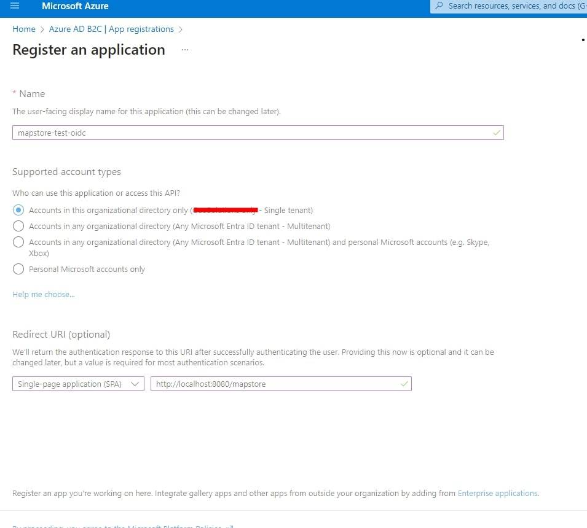
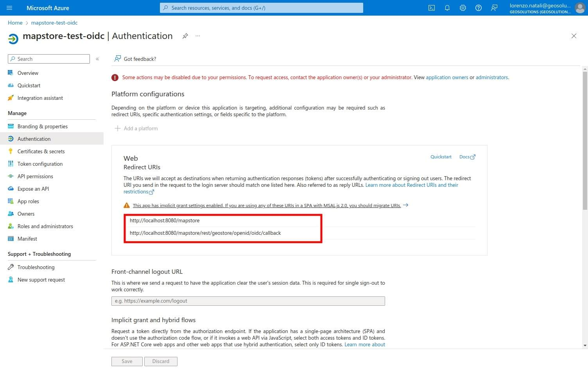
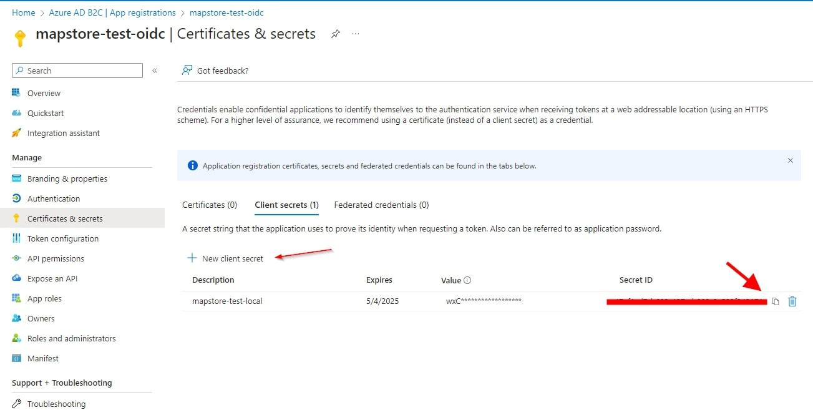
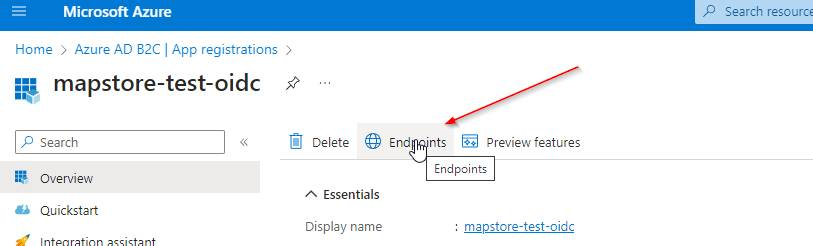

# Integration with OpenID connect

MapStore allows to integrate with [OpenID connect](https://openid.net/connect/) services. This allows to use external services to authenticate users in MapStore. This is useful when you have to integrate MapStore with an existing authentication system, or when you want to use a third-party service to authenticate users.

## Customizing logo and text in Login Form

For details about the configuration for a specific service, please refer to the corresponding section below. If you want to customize the icon and/or text displayed, you can refer to the documentation of the [LoginPlugin](https://mapstore.geosolutionsgroup.com/mapstore/docs/api/plugins#plugins.Login).

By default, the `authenticationProviders` field contains only `{"type": "basic", "provider": "geostore"}`, which represents the standard login on **MapStore** using a username and password. With this default configuration, when a user tries to log in, MapStore will display the classic login form.

You can add additional providers to the list (e.g., `openid`), and they will be included as options in the login window. If you want to remove the login form and only use the added providers, you can remove the `geostore` entry from the `authenticationProviders` list.

!!! info
    If only one OpenID entry is present in `authenticationProviders` (and no `geostore` entry available), clicking on the login entry in the login menu will redirect directly to the OpenID provider login page configured, without showing the login window. If more than one entry is present in the `authenticationProviders` list, the the login window will be provided in the MapStore UI to be able choose the desired one for the authentication.

## Generic OpenID Connect configuration

MapStore integrates with any [OpenID Connect](https://openid.net/connect/)-compliant provider using a generic OIDC layer. You can configure **one or more providers simultaneously** - each identified by a name that determines the `provider` field in `localConfig.json` and the property prefix in `mapstore-ovr.properties`.

For each provider you want to enable, you have to:

- configure a client on the identity provider (e.g., create a new client in Keycloak, a credential in Google Console, an app registration in Azure AD, etc.)
- add the provider name to `oidc_providers` and configure `{provider}OAuth2Config.*` properties in `mapstore-ovr.properties`
- add a corresponding entry to `authenticationProviders` in `localConfig.json`

### Configure OpenID provider client

This step depends on the specific OpenID provider so, please, refer to the specific documentation of the OpenID provider you are using. See the [Provider examples](#provider-examples) section below for step-by-step guides for Microsoft Azure, Google, and Keycloak.

You have to get the following information:

- **Client ID**: the client id. This is the client id that must be present on the OpenID provider
- **Client Secret**: the client secret. This is the client secret for the client id on the OpenID provider
- **Discovery URL**: the discovery URL. This is the URL that contains all the information for the specific service.

### Configure the MapStore back-end

In order to configure the generic OpenID provider you have to:

- create/edit `mapstore-ovr.properties` file (in data-dir or class path) to configure the generic provider this way:

```properties
# Register "oidc" as an OIDC provider
oidc_providers=oidc

# Enable the OpenID Connect filter
oidcOAuth2Config.enabled=true

# Client credentials from the OpenID provider
oidcOAuth2Config.clientId=mapstore-server
oidcOAuth2Config.clientSecret=<THE_CLIENT_SECRET>
oidcOAuth2Config.sendClientSecret=true

# Discovery URL: the .well-known/openid-configuration endpoint of the provider
oidcOAuth2Config.discoveryUrl=https://<idp-host>/.well-known/openid-configuration

# Create the user on first login if not already present
oidcOAuth2Config.autoCreateUser=true

# Redirect URIs
oidcOAuth2Config.redirectUri=http://<my-domain-site>/mapstore/rest/geostore/openid/oidc/callback
# Internal redirect URI (can be relative path, e.g. `../../..` to work across domains)
oidcOAuth2Config.internalRedirectUri=http://<my-domain-site>/mapstore

# User name attribute (default: email)
# oidcOAuth2Config.principalKey=email

# Scopes to request (if omitted, MapStore uses the ones from the discovery document)
# oidcOAuth2Config.scopes=openid,email,profile

# Role mapping: claim name that carries roles, and mapping to MapStore roles (ADMIN or USER)
# oidcOAuth2Config.rolesClaim=roles
# oidcOAuth2Config.roleMappings=admin:ADMIN,user:USER
# Default role when no mapping matches
# oidcOAuth2Config.authenticatedDefaultRole=USER

# Group mapping: claim name that carries groups, and mapping to MapStore groups
# oidcOAuth2Config.groupsClaim=groups
# oidcOAuth2Config.groupMappings=my-idp-group:my-mapstore-group
# If an IdP role/group name contains ':' or ',', escape it with a backslash.
# In this .properties file the backslash must be doubled:
# oidcOAuth2Config.groupMappings=landscape\\:read:landscape_read
# oidcOAuth2Config.dropUnmapped=false

# Groups always assigned to every authenticated user, in addition to claim-derived ones.
# Created automatically if they do not exist; not subject to groupMappings/dropUnmapped.
# oidcOAuth2Config.defaultGroups=oidc-users

# Global logout (RP-initiated logout): invoke IdP logout on MapStore logout
# oidcOAuth2Config.globalLogoutEnabled=true
# URI to redirect to after logout (optional, required by some providers)
# oidcOAuth2Config.postLogoutRedirectUri=https://<your-domain>/mapstore/

# PKCE (Proof Key for Code Exchange) recommended for public clients
# oidcOAuth2Config.usePKCE=false

# Bearer token validation strategy: jwt (default), introspection, or auto
# oidcOAuth2Config.bearerTokenStrategy=jwt

# Maximum token age in seconds for bearer JWT validation (0 = disabled)
# oidcOAuth2Config.maxTokenAgeSecs=0

# Access type for authorization (set to "offline" to request a refresh token, e.g. for Google)
# oidcOAuth2Config.accessType=offline
```

- `oidcOAuth2Config.enabled`: must be `true` to activate this provider.
- `oidcOAuth2Config.clientId`: the client id registered on the OpenID provider.
- `oidcOAuth2Config.clientSecret`: the client secret for the client id.
- `oidcOAuth2Config.discoveryUrl`: the `.well-known/openid-configuration` URL of the provider. All endpoints are auto-discovered from this URL at startup. If the discovery endpoint is unreachable at startup (e.g. the IdP is behind a firewall not accessible from the server), you can omit `discoveryUrl` and set each endpoint manually:

```properties
oidcOAuth2Config.authorizationUri=https://<idp-host>/protocol/openid-connect/auth
oidcOAuth2Config.accessTokenUri=https://<idp-host>/protocol/openid-connect/token
oidcOAuth2Config.checkTokenEndpointUrl=https://<idp-host>/protocol/openid-connect/userinfo
oidcOAuth2Config.idTokenUri=https://<idp-host>/protocol/openid-connect/certs
oidcOAuth2Config.logoutUri=https://<idp-host>/protocol/openid-connect/logout
oidcOAuth2Config.revokeEndpoint=https://<idp-host>/protocol/openid-connect/revoke
oidcOAuth2Config.introspectionEndpoint=https://<idp-host>/protocol/openid-connect/token/introspect
```

These values correspond to the standard fields in the discovery document and are the same endpoints your browser would resolve via the discovery URL at runtime.

- `oidcOAuth2Config.sendClientSecret`: if `true`, the client secret is sent to the token endpoint (required for `client_secret_post`).
- `oidcOAuth2Config.autoCreateUser`: if `true`, the user is created on first login if not already in the MapStore database. Set to `false` when users are managed by an external service like LDAP.
- `oidcOAuth2Config.redirectUri`: callback URI registered on the provider; must end with `/rest/geostore/openid/oidc/callback` (replace `oidc` with the provider name if using a different name).
- `oidcOAuth2Config.internalRedirectUri`: the URI MapStore redirects to after login. Can be relative (e.g., `../../..`).
- `oidcOAuth2Config.principalKey`: (*optional*) claim used as the MapStore username. Default is `email`.
- `oidcOAuth2Config.scopes`: (*optional*) comma-separated scopes to request. If omitted, the ones from the discovery document are used.
- `oidcOAuth2Config.rolesClaim`: (*optional*) claim name containing roles to map to MapStore roles (`ADMIN` or `USER`).
- `oidcOAuth2Config.roleMappings`: (*optional*) comma-separated `idp-role:MAPSTORE_ROLE` pairs.
- `oidcOAuth2Config.authenticatedDefaultRole`: (*optional*) role assigned when no `roleMappings` entry matches. Allowed values: `USER` or `ADMIN`.
- `oidcOAuth2Config.groupsClaim`: (*optional*) claim name containing groups to map to MapStore user groups.
- `oidcOAuth2Config.groupMappings`: (*optional*) comma-separated `idp-group:mapstore-group` pairs. Escape `:` and `,` in group names with a backslash (doubled in `.properties` files: `\\:`).
- `oidcOAuth2Config.dropUnmapped`: (*optional*) when `false` (default), **all** groups found in the claim are created in MapStore and assigned to the user, even if they have no entry in `groupMappings`. When `true`, only groups that have an explicit entry in `groupMappings` are assigned; unmatched ones are ignored.
- `oidcOAuth2Config.defaultGroups`: (*optional*) comma-separated group names always assigned to every authenticated user, in addition to the claim-derived ones. These groups are created automatically if they do not exist and are not subject to `groupMappings`/`dropUnmapped`.
- `oidcOAuth2Config.globalLogoutEnabled`: (*optional*) if `true`, invokes RP-initiated logout on the IdP when the user logs out of MapStore.
- `oidcOAuth2Config.postLogoutRedirectUri`: (*optional*) URI to redirect to after IdP logout; required by some providers (e.g., Keycloak).
- `oidcOAuth2Config.usePKCE`: (*optional*) enables Authorization Code Flow with PKCE. Recommended for public clients. Default is `false`.
- `oidcOAuth2Config.bearerTokenStrategy`: (*optional*) strategy for validating bearer JWTs: `jwt` (default, JWKS signature verification), `introspection` (RFC 7662 token introspection, required for opaque tokens), or `auto` (try JWT first, fall back to introspection).
- `oidcOAuth2Config.maxTokenAgeSecs`: (*optional*) maximum accepted age in seconds for bearer JWTs. `0` disables the check.
- `oidcOAuth2Config.accessType`: (*optional*) passed as the `access_type` parameter in the authorization request. Set to `offline` to request a refresh token (required by Google).

!!! note
    The only mandatory claim is `email` (or whatever you set in `oidcOAuth2Config.principalKey`). Role and group mapping are optional. All OIDC providers, including Keycloak, Google, and Azure, use the same generic configuration.

### Configure the MapStore front-end

- Add an entry for `oidc` in `authenticationProviders` inside `localConfig.json` file.

```json
{
    "authenticationProviders": [
      {
        "type": "openID",
        "provider": "oidc",
        "title": "My custom identity provider"
      },
      {
        "type": "basic",
        "provider": "geostore"
      }
    ]
}
```

!!! note
    You can:
    - customize the `title` to be displayed in the login form
    - add an `imageURL` to show a custom icon in the login form. For example, to use a base64-encoded SVG image:

    ```json
    {
    "type": "openID",
    "provider": "oidc",
    "title": "My custom identity provider",
    "imageURL": "data:image/svg+xml;base64,PHN2ZyB4bWxucz0iaHR0cDovL3d3dy53My5vcmcvMjAwMC9zdmciIHdpZHRoPSIxMDAiIGhlaWdodD0iMTAwIj48Y2lyY2xlIGN4PSI1MCIgY3k9IjUwIiByPSI0MCIgc3R5bGU9ImZpbGw6I2ZmMDAwMDsiIC8+PC9zdmc+"
    }
    ```

    - use only one `authenticationProviders`, removing the `geostore` entry, if you want to use only the OpenID provider. In this case the user will be redirected directly to the OpenID provider without showing the login form.
    - `showAccountInfo` is `false` by default for OpenID provider. To allow users to view their account details in MapStore, add `"showAccountInfo": true` to the provider entry:

    ```json
    {
      "type": "openID",
      "provider": "oidc",
      "showAccountInfo": true
    }
    ```

## Multiple simultaneous providers

You can run multiple OIDC providers at the same time by listing them in `oidc_providers` (comma-separated) and configuring each with its own `{provider}OAuth2Config.*` prefix. Each provider's `redirectUri` **must** include the provider name in the path.

Example: Keycloak + Google

```properties
# Both providers active simultaneously
oidc_providers=keycloak,google

# Keycloak
keycloakOAuth2Config.enabled=true
keycloakOAuth2Config.clientId=mapstore-server
keycloakOAuth2Config.clientSecret=<KEYCLOAK_SECRET>
keycloakOAuth2Config.discoveryUrl=https://keycloak.example.com/realms/myrealm/.well-known/openid-configuration
keycloakOAuth2Config.redirectUri=https://my.mapstore.site.com/mapstore/rest/geostore/openid/keycloak/callback
keycloakOAuth2Config.internalRedirectUri=https://my.mapstore.site.com/mapstore/
keycloakOAuth2Config.autoCreateUser=true

# Google
googleOAuth2Config.enabled=true
googleOAuth2Config.clientId=<GOOGLE_CLIENT_ID>
googleOAuth2Config.clientSecret=<GOOGLE_CLIENT_SECRET>
googleOAuth2Config.discoveryUrl=https://accounts.google.com/.well-known/openid-configuration
googleOAuth2Config.redirectUri=https://my.mapstore.site.com/mapstore/rest/geostore/openid/google/callback
googleOAuth2Config.internalRedirectUri=https://my.mapstore.site.com/mapstore/
googleOAuth2Config.autoCreateUser=true
googleOAuth2Config.accessType=offline
```

`localConfig.json`: both providers listed:

```json
{
    "authenticationProviders": [
      {
        "type": "openID",
        "provider": "keycloak",
        "title": "Keycloak"
      },
      {
        "type": "openID",
        "provider": "google",
        "title": "Google"
      },
      {
        "type": "basic",
        "provider": "geostore"
      }
    ]
}
```

!!! note
    Use `oidc_providers` (underscore) not `oidc.providers` (dot). The dot form conflicts with Spring's `PropertyOverrideConfigurer` which interprets `oidc.providers` as bean `oidc`, property `providers`.

## Provider examples

The following sections show complete configurations for three common providers. Each is a specific instance of the [generic OIDC layer](#generic-openid-connect-configuration) described above — the configuration structure is the same across all providers.

### Microsoft Azure (Entra ID)

Microsoft Azure (Entra ID) provides OpenID Connect support. Please refer to the [Microsoft Azure documentation](https://learn.microsoft.com/en-us/entra/identity-platform/quickstart-register-app) for details.

#### Configure Azure app registration

Here a quick summary of the steps to configure Microsoft Azure as an OpenID provider and get the information needed to configure MapStore:

1. Create a new application 
2. Set the proper valid redirect URLs  to: `https://<your-domain>/mapstore/rest/geostore/openid/oidc/callback`
3. Create and copy the client secret 
4. Add optional claims (e.g. `email`, `family_name`, `given_name`) in **Token configuration** if needed
5. Copy endpoints and data to configure MapStore 

From the Azure app registration you need three values:

| Value | Where to find it | Used as |
| --- | --- | --- |
| **Application (client) ID** | App registration → Overview | `oidcOAuth2Config.clientId` |
| **Client secret value** | App registration → Certificates & secrets → New client secret | `oidcOAuth2Config.clientSecret` |
| **OpenID Connect metadata document** | App registration → Endpoints → OpenID Connect metadata document | `oidcOAuth2Config.discoveryUrl` |

!!! note
    If you want to assign groups to users from Azure, you also need to add the `GroupMember.Read.All` scope to the API permissions and grant admin consent.
    To do it you need to go to API permissions → Add a permission → Microsoft Graph → Application permissions → Delegated Permission → select `GroupMember.Read.All` → Add permissions, then click on **Grant admin consent**.

#### Configure MapStore back-end for Azure

`mapstore-ovr.properties`:

```properties
oidc_providers=azure

azureOAuth2Config.enabled=true
azureOAuth2Config.clientId=<APPLICATION_CLIENT_ID>
azureOAuth2Config.clientSecret=<CLIENT_SECRET_VALUE>
azureOAuth2Config.sendClientSecret=true
azureOAuth2Config.discoveryUrl=<OPENID_CONNECT_METADATA_DOCUMENT_URL>
azureOAuth2Config.autoCreateUser=true
azureOAuth2Config.redirectUri=https://<your-domain>/mapstore/rest/geostore/openid/azure/callback
azureOAuth2Config.internalRedirectUri=https://<your-domain>/mapstore
note: GroupMember.Read.All scope is required to get group info in the token for group mapping
azureOAuth2Config.scopes=openid,email,profile

```

If you need to assign groups to users from Azure, add the `GroupMember.Read.All` scope to the API permissions and grant admin consent. This allows group information to be included in the token for group mapping, and enable `msGraphEnabled` and `msGraphGroupsEnabled` to get group info from Microsoft Graph.

```properties
# replace this property
azureOAuth2Config.scopes=openid,email,profile,GroupMember.Read.All
# add these properties to enable group retrieval from Microsoft Graph
azureOAuth2Config.msGraphEnabled=true
azureOAuth2Config.msGraphGroupsEnabled=true

```

!!! note
    There is a limit of 200 groups/roles returned in the token by Azure. If a user belongs to more than 200 groups, the `groups` claim is omitted and replaced with an overage indicator. From GeoStore 2.7 (planned for MapStore 2026.03.00) there are additional properties to enable retrieving groups from Microsoft Graph as a workaround for this limitation, but it still requires the `GroupMember.Read.All` scope and admin consent.

    ```properties
    # These properties will be available from geostore 2.7
    # This forces to have groups resolved from Microsoft Graph also if the groups claim is present in the token, to avoid the issue of Azure AD not emitting group claims when a user belongs to too many groups (over 200). With this setting, group mapping will work even for users with a large number of groups, as all group information will be retrieved from Microsoft Graph instead of relying on the token claims.
    # oidcOAuth2Config.msGraphAlwaysResolveGroups=false
    # This allows to customize the URL, if changes in the future
    # oidcOAuth2Config.msGraphEndpoint=<https://graph.microsoft.com/v1.0>
    # This allows to enable role retrieval from Microsoft Graph, if you use App Roles for role mapping instead of group claims. This is also recommended to avoid the issue of Azure AD not emitting role claims when a user belongs to too many groups (over 200), as role information will be retrieved from Microsoft Graph instead of relying on the token claims.
    # oidcOAuth2Config.msGraphRolesEnabled=false
    ```

!!! note
    This is only an example, azure allows complex configurations with different types of credentials, role and group mapping, different tenants... Please refer to the Microsoft Azure documentation for more details.

#### Configure MapStore front-end for Azure

`configs/localConfig.json.patch` ( *with a custom title and an image with the Microsoft logo* to show in the login form)

```json
    [    {
        "op": "add",
        "path": "/authenticationProviders",
        "value": [
                {
                    "type": "openID",
                    "provider": "oidc",
                    "title": "Microsoft",
                    "imageURL": ""
                },
                {
                    "type": "basic",
                    "provider": "geostore"
                }
            ]

    }
]
```

#### Role mapping via Azure App Roles

The recommended approach for mapping MapStore roles in Azure is to use **App Roles** defined in the application registration. This avoids the group GUID and 200-group-overage limitations of the `groups` claim and produces a clean `roles` claim directly in the ID token.

**Step 1**: Create an App Role in the Azure app registration

1. In the App Registration → **App roles → Create app role**
2. Set **Display name** and **Value** to `ADMIN` (the value is what appears in the token)
3. Set **Allowed member types** to `Users/Groups`
4. Enable the role and save

**Step 2**: Assign the role to users or groups

1. Go to **Enterprise Applications** → select your application → **Users and groups → Add user/group**
2. Select the user (or group) and assign the `ADMIN` role

!!! warning
    Assigning App Roles to groups requires an **Azure AD P1 or P2** (Entra ID P1/P2) license. Without it, roles can only be assigned to individual users.

With this configuration the ID token will contain a `roles` claim like:

```json
{
  "roles": ["ADMIN"],
  "email": "user@example.com"
}
```

**Step 3**: Configure MapStore to read the `roles` claim

Add role mapping to `mapstore-ovr.properties`:

```properties
# Map the Azure 'roles' claim to MapStore roles
oidcOAuth2Config.rolesClaim=roles
oidcOAuth2Config.roleMappings=ADMIN:ADMIN
# Users without a matching role get USER by default
oidcOAuth2Config.authenticatedDefaultRole=USER
```

#### Group mapping in Azure

By default the `groups` claim in the Azure ID token contains **Object ID GUIDs**, not display names. To emit display names instead, edit the application **Manifest** (App Registration → Manifest) and set:

```json
{
  "groupMembershipClaims": "ApplicationGroup",
  "optionalClaims": {
    "idToken": [{
      "name": "groups",
      "additionalProperties": ["cloud_displayname"]
    }]
  }
}
```

!!! note
    `groupMembershipClaims` can be set to `"SecurityGroup"` or `"All"` to include broader group sets, but display names via `cloud_displayname` are only emitted for groups **explicitly assigned to the application**. Groups not assigned to the app may still appear as GUIDs regardless of this setting.

!!! warning
    If a user belongs to more than 200 groups, Azure omits the `groups` claim entirely and replaces it with an overage indicator. In that case group-based mapping will not work. This is one of the key reasons to prefer App Roles over group claims where possible.

Once display names are emitted, configure MapStore to read them:

```properties
oidcOAuth2Config.groupsClaim=groups
oidcOAuth2Config.groupMappings=<azure-group-display-name>:<mapstore-group-name>
```

### Google

Google OpenID Connect is configured as a named OIDC provider using the generic OIDC layer.

#### Create Oauth 2.0 credentials on Google Console

In order to setup the openID connection you have to setup a project in Google API Console to obtain Oauth 2.0 credentials and configure them. Here a quick summary of the steps to configure Google as an OpenID provider. For more details, please refer to the [Google documentation](https://developers.google.com/identity/openid-connect/openid-connect).

- Open the Google developer console and, from credentials section, create a new credential of type **Oauth client ID**


- Set the **Application Type** to **Web Application**, name it as you prefer and configure the root of the application as an authorized redirect URI. Then click on **Create**


- After creation you will obtain **ClientID** and **Client Secret** to use to configure MapStore.

Please follow the [Google documentation](https://developers.google.com/identity/protocols/oauth2/openid-connect) for any detail or additional configuration.

#### Configure MapStore back-end for Google OpenID

After the setup, you will have to:

- create/edit the `mapstore-ovr.properties` file (in data-dir or class path) to configure the Google OpenID integration. Use the provider name `google` so that the callback URL matches:

```properties
# Register "google" as an OIDC provider
oidc_providers=google

# Enable the Google OpenID Connect filter
googleOAuth2Config.enabled=true

# Client credentials from Google Developer Console
googleOAuth2Config.clientId=<the_client_id_from_google_dev_console>
googleOAuth2Config.clientSecret=<the_client_secret_from_google_dev_console>

# Create the user if not already present in MapStore
googleOAuth2Config.autoCreateUser=true

# Redirect URL (must be registered in Google Console too)
googleOAuth2Config.redirectUri=https://<your-application-domain>/mapstore/rest/geostore/openid/google/callback
# Internal redirect URI (can be relative, e.g. `../../..` to work across domains)
googleOAuth2Config.internalRedirectUri=https://<your-application-domain>/mapstore/

# Discovery URL for Google's OIDC endpoints
googleOAuth2Config.discoveryUrl=https://accounts.google.com/.well-known/openid-configuration

# Request a refresh token (required for long-lived sessions with Google)
googleOAuth2Config.accessType=offline
```

!!! note
    If you also configure another provider (e.g. the generic `oidc`), list all providers: `oidc_providers=oidc,google`.

#### Configure MapStore front-end for Google OpenID

- Add an entry for `google` in `authenticationProviders` inside `localConfig.json` file.

```json
{
    "authenticationProviders": [
      {
        "type": "openID",
        "provider": "google"
      },
      {
        "type": "basic",
        "provider": "geostore"
      }
    ]
}
```

### Keycloak

[Keycloak](https://www.keycloak.org/) is an open source identity and access management application widely used. MapStore integrates with Keycloak via the generic OIDC layer.

#### Configure Keycloak Client

Create a new Client on Keycloak. In this guide we will name it `mapstore-server` (if you also need SSO, you will create a second client called `mapstore-client`).


- Configure it as `Confidential`, setting the Redirect URL to your MapStore base root with a `*` at the end (e.g. `https://my.mapstore.site.com/mapstore/*`)


Note the **realm** and **auth-server-url** from Keycloak, you will use them to build the `discoveryUrl`.

#### Configure MapStore back-end for Keycloak OpenID

Create/edit `mapstore-ovr.properties` file (in data-dir or class path) to configure the Keycloak provider:

```properties
# Register "keycloak" as an OIDC provider
oidc_providers=keycloak

# Enable the Keycloak OpenID Connect filter
keycloakOAuth2Config.enabled=true

# Client credentials from Keycloak
keycloakOAuth2Config.clientId=mapstore-server
keycloakOAuth2Config.clientSecret=<CLIENT_SECRET>
keycloakOAuth2Config.sendClientSecret=true

# Discovery URL: <auth-server-url>/realms/<realm>/.well-known/openid-configuration
keycloakOAuth2Config.discoveryUrl=https://keycloak.example.com/realms/myrealm/.well-known/openid-configuration

# Redirect URLs
keycloakOAuth2Config.redirectUri=https://my.mapstore.site.com/mapstore/rest/geostore/openid/keycloak/callback
keycloakOAuth2Config.internalRedirectUri=https://my.mapstore.site.com/mapstore/

# Create user on first login (set to false if users come from LDAP or another external source)
keycloakOAuth2Config.autoCreateUser=true

# Scopes to request: explicitly set to avoid requesting offline_access by default,
# which requires the Keycloak client/user to have the offline_access role configured.
keycloakOAuth2Config.scopes=openid,profile,email

# Role mapping: dot-notation path to the claim carrying roles, and mapping to MapStore roles (ADMIN or USER)
keycloakOAuth2Config.rolesClaim=realm_access.roles
keycloakOAuth2Config.roleMappings=admin:ADMIN,user:USER
# Default role when no mapping matches
keycloakOAuth2Config.authenticatedDefaultRole=USER

# Group mapping: claim name that carries groups, and mapping to MapStore groups
keycloakOAuth2Config.groupsClaim=groups
keycloakOAuth2Config.groupMappings=MY_KEYCLOAK_GROUP:MY_MAPSTORE_GROUP,MY_KEYCLOAK_GROUP2:MY_MAPSTORE_GROUP2
# false (default) = all groups from the claim are created and assigned; true = only mapped ones
keycloakOAuth2Config.dropUnmapped=false

# Groups always assigned to every authenticated user (created on the fly if missing)
# keycloakOAuth2Config.defaultGroups=keycloak-users

# RP-initiated global logout
# keycloakOAuth2Config.globalLogoutEnabled=true
# keycloakOAuth2Config.postLogoutRedirectUri=https://my.mapstore.site.com/mapstore/
```

- `oidc_providers=keycloak`: registers the `keycloakOAuth2Config` bean; required in geostore 2.6+.
- `keycloakOAuth2Config.discoveryUrl`: the Keycloak OIDC discovery URL - `<auth-server-url>/realms/<realm>/.well-known/openid-configuration`. This replaces the old `keycloakOAuth2Config.jsonConfig`.
- `keycloakOAuth2Config.redirectUri`: must end with `/rest/geostore/openid/keycloak/callback`.
- `keycloakOAuth2Config.internalRedirectUri`: the MapStore home page URI after login.
- `keycloakOAuth2Config.autoCreateUser`: `true` to create DB users on first login; `false` when using LDAP or external user stores.
- `keycloakOAuth2Config.roleMappings`: comma-separated `keycloak-role:MAPSTORE_ROLE` pairs. Allowed MapStore values: `USER` or `ADMIN`.
- `keycloakOAuth2Config.authenticatedDefaultRole`: role applied when no `roleMappings` entry matches.
- `keycloakOAuth2Config.groupMappings`: comma-separated `keycloak-group:mapstore-group` pairs.
- `keycloakOAuth2Config.dropUnmapped`: `false` (default) creates and assigns **all** groups from the claim, even unmapped ones; `true` assigns only groups with an explicit entry in `groupMappings`.
- `keycloakOAuth2Config.defaultGroups`: (*optional*) comma-separated group names always assigned to every authenticated user.

!!! note
    The `keycloakOAuth2Config.jsonConfig` property from earlier versions is **no longer supported**. Use `keycloakOAuth2Config.discoveryUrl` instead.

#### Configure MapStore front-end for Keycloak OpenID

- Add an entry for `keycloak` in `authenticationProviders` inside `localConfig.json` file.

```json
{
    "authenticationProviders": [
      {
        "type": "openID",
        "provider": "keycloak"
      },
      {
        "type": "basic",
        "provider": "geostore"
      }
    ]
}
```

#### Role and group mapping in Keycloak

##### Role mapping

GeoStore supports only two roles: `ADMIN` and `USER`. The simplest approach is to set `authenticatedDefaultRole=USER` and promote admin users manually through the MapStore UI.

If you want the token to drive admin assignment automatically, set `rolesClaim` to point at the claim that carries roles. MapStore supports dot-notation paths for nested claims, so you can reference Keycloak's default `realm_access.roles` structure directly:

```properties
keycloakOAuth2Config.rolesClaim=realm_access.roles
keycloakOAuth2Config.roleMappings=admin:ADMIN,user:USER
keycloakOAuth2Config.authenticatedDefaultRole=USER
```

Alternatively, add a **User Realm Role** protocol mapper in Keycloak to emit a flat top-level claim and use that instead. In the Keycloak Admin Console, go to **Clients → mapstore-server → Client scopes → mapstore-server-dedicated → Add mapper → By configuration → User Realm Role**, then set:

| Field | Value |
| --- | --- |
| Name | `roles` |
| Token Claim Name | `roles` |
| Add to ID token | On |
| Add to access token | On |
| Multivalued | On |

This produces `"roles": ["admin", "user"]` at the token root:

```properties
keycloakOAuth2Config.rolesClaim=roles
keycloakOAuth2Config.roleMappings=admin:ADMIN,user:USER
keycloakOAuth2Config.authenticatedDefaultRole=USER
```

##### Group mapping

Add a **Group Membership** mapper in the same client scope:

| Field | Value |
| --- | --- |
| Name | `groups` |
| Token Claim Name | `groups` |
| Full group path | Off |
| Add to ID token | On |

This produces `"groups": ["my-group", "another-group"]` with display names (no leading `/`). Configure MapStore:

```properties
keycloakOAuth2Config.groupsClaim=groups
keycloakOAuth2Config.groupMappings=my-keycloak-group:my-mapstore-group
# false = all groups from claim created/assigned; true = only mapped ones
keycloakOAuth2Config.dropUnmapped=false
```
