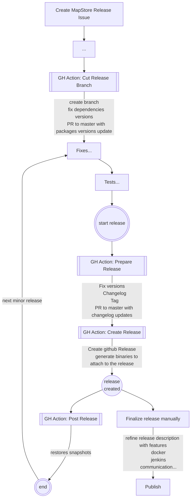

# How to release

To create a new MapStore release, you need to:

- Create an issue of type `Mapstore Release` on GitHub by clicking [here](https://github.com/geosolutions-it/MapStore2/issues/new?assignees=&labels=internal&template=release_steps.md&title=) with the title of the release.
- Follow the checklist in the issue created.

Here below some details about changelog generation and naming conventions.

## Changelog generation

Generate new changelog by running this:

```sh
npm run generate:changelog <oldReleaseNumber>  <newReleaseNumber>

# usage
# generate:changelog 2022.01.00 2022.02.00
```

## Release Checklist

### naming conventions

#### release and tag

- **vYYYY.XX.mm** name of the release and tag. (e.g. `v2022.01.01`)
- **YYYY** is the year,
- **XX** is the incremental number of the release for the current year (starting from 01)
- **mm** is an incremental value (starting from 00) to increment for minor releases

#### stable branch

- **YYYY.XX.xx** name of stable branch (e.g. `2022.01.xx` )
- **YYYY** is the year
- **XX** is the incremental number of the release for the current year (starting from 01)
- **xx** is the fixed text `xx`

## Release procedure details

### Github actions

The github actions are configured to automate the release process.

In particular the process is composed by 4 steps:

- **Cut Release Branch** creates a new branch from master with the name of the stable branch
- **Prepare Release** updates the version of the packages and creates the changelog
- **Create Release** creates the github draft release
- **Post Release** restores the snapshots

In this process the user has to manually finalize the release by adding the release description and the binaries to the release.
Everything is listed in the checklist of the issue created at the beginning.

Here a flow chart that describes the process:



### Git graph structure

The procedure produces the following git graph structure:


