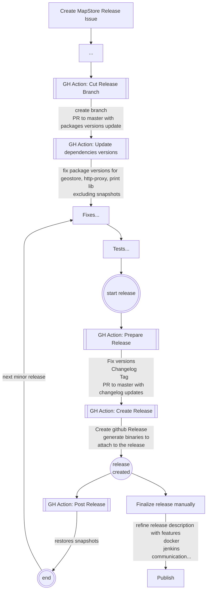

# How to release

To create a new MapStore release, you need to:

- Create an issue of type `Mapstore Release` on GitHub by clicking [here](https://github.com/geosolutions-it/MapStore2/issues/new?assignees=&labels=internal&template=release_steps.md&title=) with the title of the release.
- Follow the checklist in the issue created.

Here below some details about changelog generation and naming conventions.

## Naming conventions

### release and tag

- **vYYYY.XX.mm** name of the release and tag. (e.g. `v2022.01.01`)
- **YYYY** is the year,
- **XX** is the incremental number of the release for the current year (starting from 01)
- **mm** is an incremental value (starting from 00) to increment for minor releases

### stable branch

- **YYYY.XX.xx** name of stable branch (e.g. `2022.01.xx` )
- **YYYY** is the year
- **XX** is the incremental number of the release for the current year (starting from 01)
- **xx** is the fixed text `xx`

## Release procedure details

### Github actions

The github actions are configured to automate the release process.

In particular the process is composed by 4 steps:

- **Cut Release Branch** creates a new branch from master with the name of the stable branch
- **Prepare Release** updates the version of the packages and creates the changelog
- **Create Release** creates the github draft release
- **Post Release** restores the snapshots

In this process the user has to manually finalize the release by adding the release description and the binaries to the release.
Everything is listed in the checklist of the issue created at the beginning.

Here a flow chart that describes the process:



### Git graph structure

The procedure produces the following git graph structure:


### Changelog generation

The changelog generation is now automated. Anyway it is possible to generate the changelog manually by running the following command:

```sh
npm run generate:changelog <oldReleaseNumber>  <newReleaseNumber>

# usage
# e.g. npm run generate:changelog 2022.01.00 2022.02.00
```

This produces some text that can be used to update the changelog file.

### Handling errors

If in a certain point we notice some errors, the separation of the tasks allows to restart the process from the point where the error occurred.

For instance if after tag creation we notice some problem or we have some failures, we can fix the problem, delete and recreate the tag manually and recreate the release by running the `Create Release` action.

### Testing and fixing release procedure

For testing and fixing the release procedure it is possible to run the release procedure on your fork.
anyway "Create, Prepare and Post Release" actions are configured to run only on the main repository. This is done to avoid that the release procedure is triggered automatically by forks in some cases.
So on your fork you will need to manually edit the workflow files to enable the actions to run on your fork.

In particular you will need to edit some lines like this:

```yaml
if:  ${{ github.event_name == 'push' && github.repository == 'geosolutions-it/MapStore2' }}
```

Removing the condition or changing the repository name.
