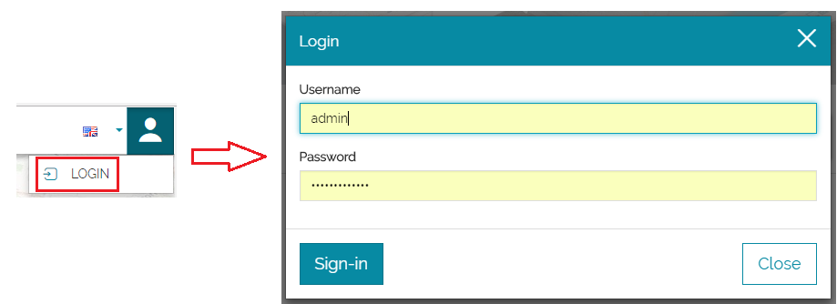
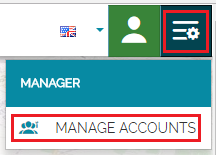
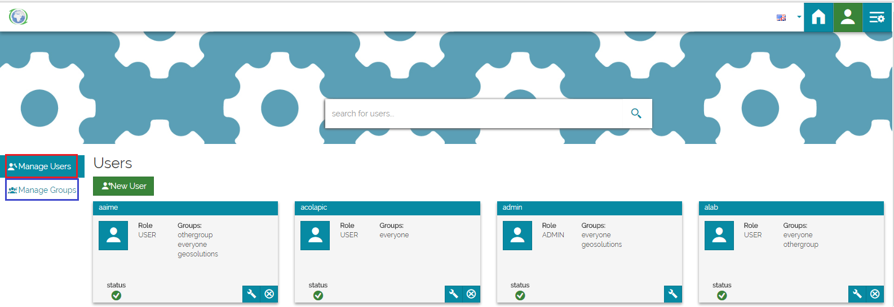
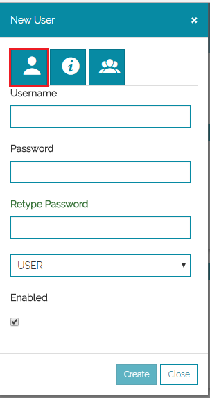
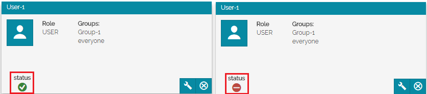
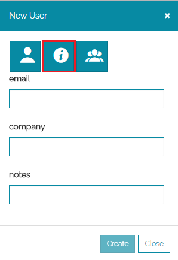
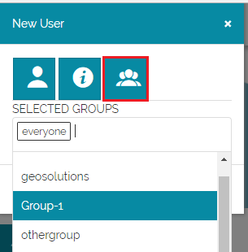
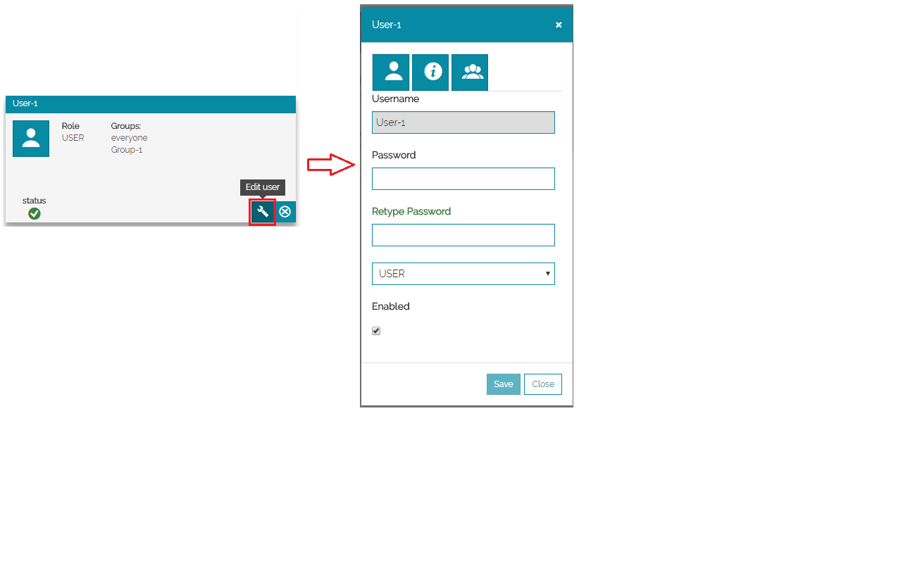
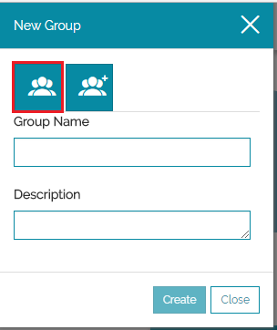
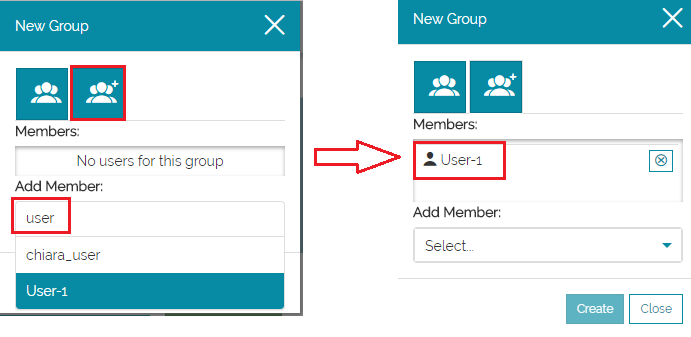

# Managing Users and Groups
***************************

From the *Home Page*:

* **Click** on the *Account* icon then **Log in** as administrator. 

     

* **Click** on the *Manager Menu* then on *MANAGE ACCOUNTS*.

     

You will be addressed to a new page that contains mainly a Manage Users and a Manage Groups pages which allow you to create new or to modify already existing users and groups. 

 

# Managing Users
****************
Creating New User
-----------------
From the *Users* page:

* **Click** on *New User* icon . A pop up form will open.
* **Fill** the first page of the form by assigning a *Username* and a *Password*.
* **Select** from the list menu to assign a user or an admin role for the user.
* Finally, **Check** the flag to enable the user. 

    

 
!!! note
    Enabled users will have a green status icon under their profile otherwise will have a red status and will not be able to log in.

     
 

* On the second page, **Compile** the page by providing further informations about the user.

    
 
* On the third page, **Select** the groups in which the user will be a part of then **Click** on *Create*.  

    
  
 
 

**Editing a User**
----------------
From the *Users* page: 

* **Click** on the *Settings* icon in order to edit a user, you will be redirected to the pop up form where you can change the user details. 

     

* Or, **Click** simply on the  icon to delete the user.

# Managing Groups
*****************
Creating New Group
------------------
From the *Groups* page:

* **Click** on *New Group* icon . A pop up form will open, **Fill** the first page of the form by assigning a *Group Name* and a *Description*. 

    

* On the second page, you can add members to the group. **Type** the user name under *Add Member* to find it then **Click** on it to add it to the list. 

    

Edit a Group
------------
As for users, you can use the edit icon  to modify the group settings or the delete icon  to delete the group. 