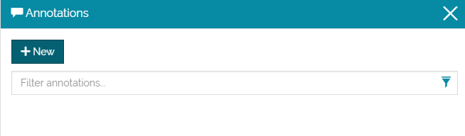

# Adding Annotations
********************

Starting from a new map or an already existing map:

* **Click** on the *Burger menu* button  from the main menu bar.
* **Click** on the *Annotations* option from the list .

The annotation page will open. 

* **Click** on  to add a new annotation. 

You will be addressed to a new page where you can draw on the map and edit the annotation properties. 

* **Click** on  to draw the annotation on the map. 

* **Click** on the map to draw it. **Enter** a title and a description then click on save.

The annotation will be added to the TOC and to the annotations list as in the figure below. 

Editing an Annotation
------------------

From the annotations list on the right:

* **Click** on the annotation you want to edit. You will be addressed to a new page. 

* **Click** on *Edit*. You will be addressed to the main annotations page. 

 

* **Click** on  button to change the marker style. 

 

* **Save** the edits. 

 