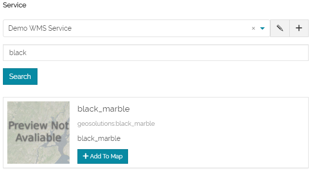

# Catalog Services
******************

The Catalog Service for the Web (CSW) is an OGC Standard to publish and search geospatial data and related metadata on the internet. It describes geospatial services such as Web Map Service (WMS) and Web Map Tile Service (WMTS).

In [MapStore 2](https://mapstore2.geo-solutions.it/mapstore/#/) the Catalog offers demo services that allow you to extract the data and add them to the map from GeoServer or to create connections to other Geoportal services.

Adding Layers from Demo Services
--------------------------------

CSW, WMS and WMTS Demo Services are available by default allowing you to import layers from GeoServer and to add them to your map.

Starting from a new map or an already existing map:

* **Click** on the *Burger menu* button  from the main menu bar.
* **Click** on the *Catalog* option from the list .

The Catalog page will open showing a list of services, a search box to search the layers by name and a list of the retrieved layers ready to be added to the map.   

* **Select** from the list *Demo WMS Service* for example. 

* **Type** a text in the search box, e.g. black, then click on the search button. 

* **Add** the layer to the map clicking on . 

Adding and Editing a Service
----------------------------

As mentioned before, [MapStore 2](https://mapstore2.geo-solutions.it/mapstore/#/) allows you to connect to remote services and to import the data from them.

* **Click** on the  button to add a new service. 

* **Type** the URL name, e.g. http://tms.comune.fi.it/geowebcache/service/wms, and the Title.
* **Select** the Type of the service.
* **Save** the service created. 

A list of layers will be loaded from the portal ready to be added to your map. 

In order to edit a service, **Click** on the edit button  and apply your changes.