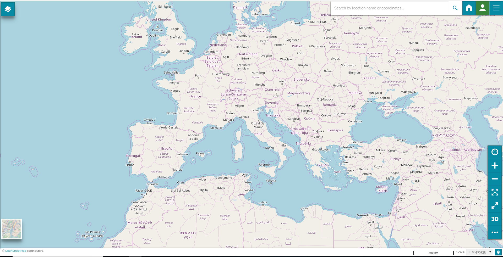
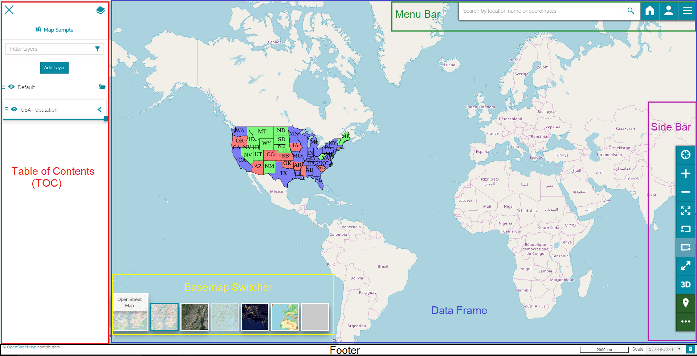

In cartogrophy, a map is any two-dimensional graphic representation of the spatial relationships of the whole or a part of the earth. In digital cartography as in [MapStore 2](https://mapstore2.geo-solutions.it/mapstore/#/), a map consists in overlaying various layers of geographic data and their styles in data frames, it contains various map elements such as a legend and a scale bar.

Let us discover the WebGIS portal interface and its main components by creating a simple map and adding a layer.  

From the *Home Page*, **Click** on the *New Map* icon . You will be addressed directly to the map viewer. 

MapStore WebGIS Portal Interface
--------------------------------
To explain you better the map viewer, we have specially added a layer. You will learn more on layers in the [Table of Contents (TOC)](toc.md) and [Menu Bar](menu-bar) sections.  
 

The portal interface of [MapStore 2](https://mapstore2.geo-solutions.it/mapstore/#/)  consists of the following blocks which will be often referred during the documentation. 

* Table of Contents (TOC), includes the map contents such as layer groups, layers and functions to manage the added layers. 

* Menu Bar, includes a search bar, connections to the home page and account, and a list of options containing several functions.

* Side Bar, a navigation panel.

* Basemap Switcher, allows to change the world map in background.

* Footer, includes a scale bar, coordinates and coordinate systems.

* Data Frame, where the layers are displayed.

Click on the keywords to learn more about the:

* [Table of Contents (TOC)](toc.md) 

* [Menu Bar](menu-bar.md) 

* [Side Bar](side-bar.md)

* [Basemap Switcher](basemap.md)

* [Footer](footer.md)

