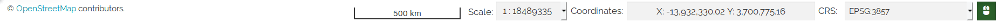

# Footer
********

Located at the bottom of the Data Frame, the Footer can be expanded by clicking on the mouse icon  and it contains a scale bar, a map scale switcher, the coordinates of the mouse pointer and a coordinate reference system switcher. 

