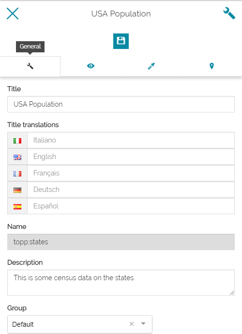
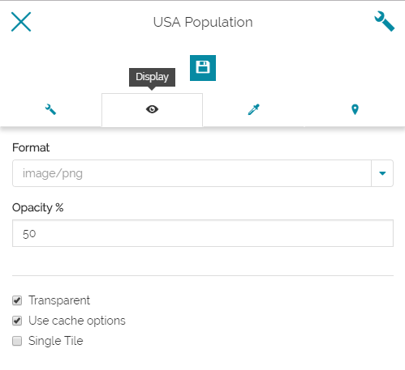
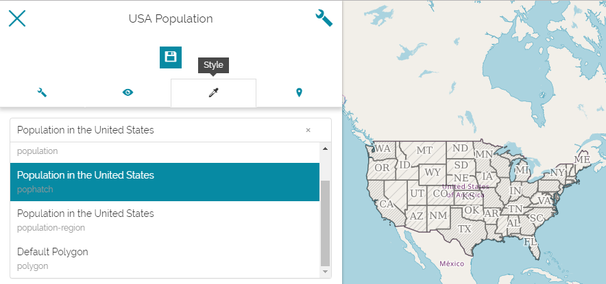
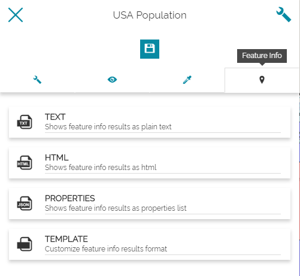
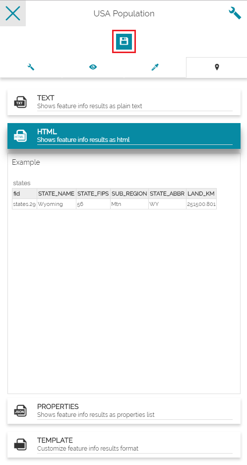
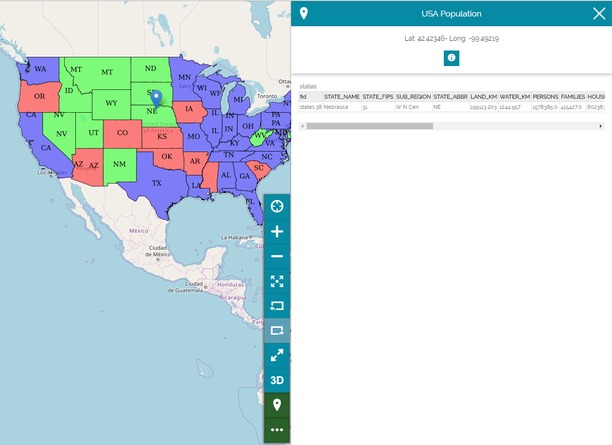

# Layer Settings
****************

In this section, you will learn how to manage the layers, to set the display mode and the style of the layers, and to set the format of the feature info.

* **Add** a layer and **Select** it.
* **Click** on  to access the settings. 

General Settings Form
---------------------
On the first page of the form, you can change the Title of the layer,
translate it in several languages, add a description and assign it to a new Layer Group as seen in the [TOC](toc.md). 

Display Form
------------

On the second page, you can set the rendering options of the layer such as the image format and the opacity (transparency). You can enable/disable the use of the cache and displaying the layer as a single tile. 

Style Form
----------
On the third page, you can choose a style from the list and apply it on the layer.

Feature Info Form
-----------------

On the fourth page, you can set the format of the extracted information from a feature or a pixel location when querying a layer. 

The Identify button, located in the [Side bar](side-bar.md), is enabled by default and allows you to query objects on the map by clicking on it. You can choose to get the info in Plain Text, HTML, Properties List or to customize your own template. As an example:

* **Select** the HTML format, Then **Save** it.

* **Click** on the layer. The info will be returned as a record (row) of a table corresponding to the info of that feature element of the layer.

    