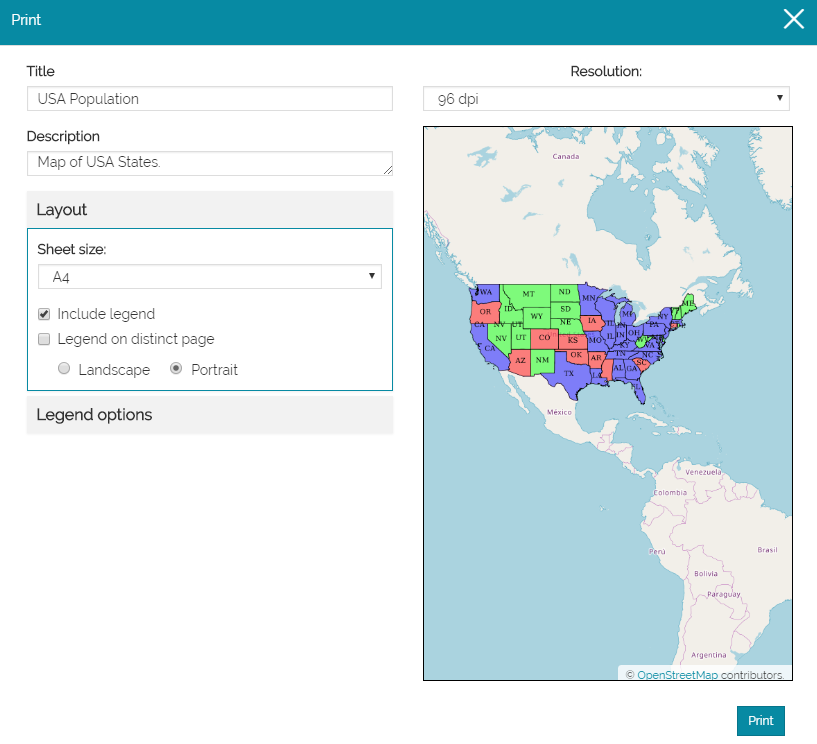
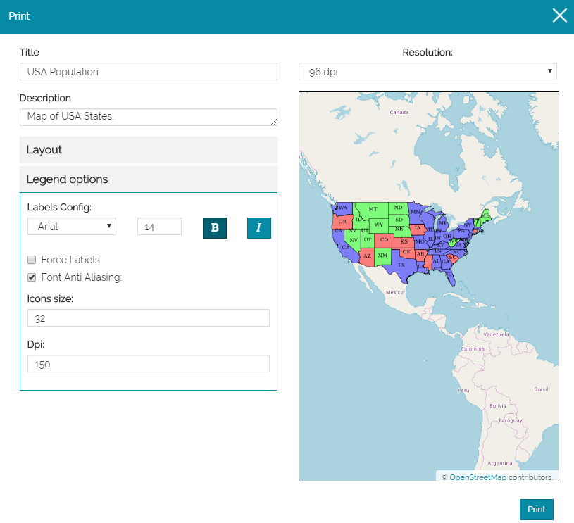
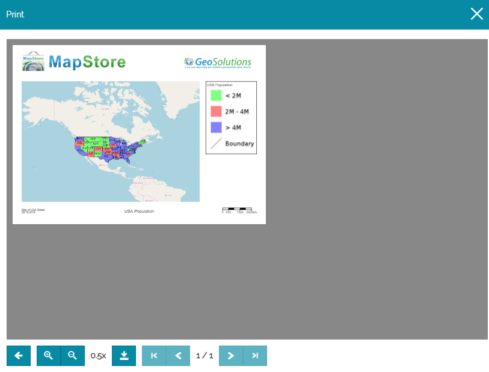

# Printing a Map
****************

Once added the layers to a new map or opened an already exsiting map:

* **Click** on the *Burger menu* button  from the main menu bar.
* **Click** on the *Print* option from the list .  
* On the pop-up page: 
  * **Enter** a *Title* and a *Description*.
  * In the *Layout* section, **Select**  the sheet size, e.g. A4 Format. **Check** the flag to include the *Legend* in the layout.
  * **Choose** between a *Landscape* or *Portrait* layout.
    
     

    

  * **Click** on *Legend options*. Here, you can set the labels font, icons size and resolution. 
  * Finally, **Choose** the *Resolution* of the print.
    
     

    

  * **Click** on the print button. You will be addressed to the print preview where you can download the layout in *PDF* by clicking on the *Download* button .
    
     
    