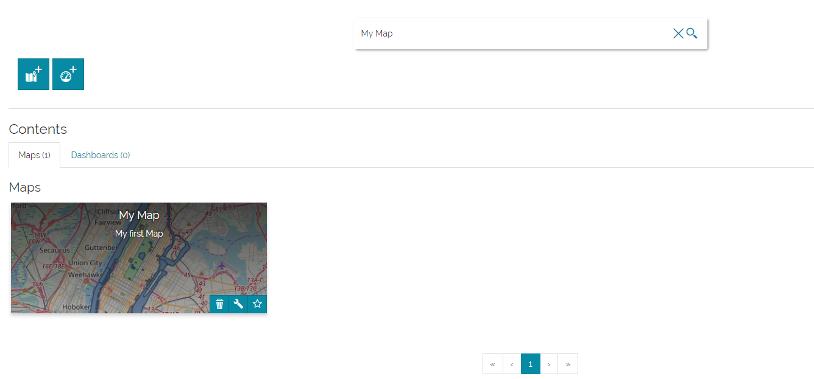

# Saving a Map
**************

From the home page:

* **Click** on  to create a new map. 

* **Add** a new layer to the map.

* **Click** on the *Burger menu* button  from the main menu bar.

* **Click** on the *Save as* option from the list .

A pop-up page will open. 

* **Enter** a *Name* and a *Description* for your map.
* **Upload** an image as a thumbnail.

* **Click** on save.

* **Return** to the home page by clicking on the .

* **Search** your saved map by typing *My Map* in the search bar then hit *Enter*. You will find your map in the *Contents* section. 

* **Click** on *My Map* to re-open it.

* **Add** another layer to the map.

* **Click** on the *Burger menu* button  from the main menu bar. 

Now a new *Option* will appear allowing you to save your edits on the map.

* **Click** on the *Save* option from the list  to save your changes.

