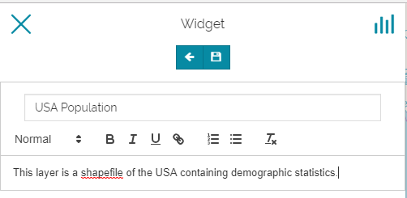

# Creating Widgets
******************

In addition to adding layers to the map, in [MapStore 2](https://mapstore2.geo-solutions.it/mapstore/#/) the user can create widgets from the added layers. Widgets are graphical elements created by the user that describe and visualize qualitatively and quantitatively the data of the layer such as charts, texts, tables and counters. 

* **Open** a new map.
* **Add** a layer (e.g. USA Population).
* **Select** the layer from the TOC.
* **Click** on the widget icon . 

The Widget page will open showing the various widget types to create. 

  

Creating Chart Widget
---------------------

* **Click** on *Chart* from the list. Another page will open showing the Chart types (Bar Chart, Pie Chart and Line Chart). 
  
    

* **Select** for example the *Bar Chart*. You will be addressed to the configuration page to configure the data.

    

 

On the top of the page, you can find a set of options  that allow you to switch back and forward the pages of the form, a connection button (highlighted in green which is active by default) that connects the chart to the viewport, and an advanced filter that allows you to plot only the filtered data. 

* **Configure** the data you want to plot and the operation. Activating the *Advanced Options* you can customize the shape of the chart. 

    

* * **Click** on *Configure widget options*  . 
    * **Set** a *Title* and a *Description*. 
    * **Click** on *Save*.

  

The widget will be added to the map. 

Expanding the options menu of the widget you can show the plotted data, edit the widget or delete it, download the data as a CSV file or save the image of the graph. 

 
 

Similarly, you can add to the map Pie and Line Charts.

Creating Text Widget
--------------------

* **Select** the Text widget from the list. The Text widget form will open where you can add a Title and the desired descriptive text. 

    

* **Click** on the save button to add the widget to the map. 

    

Creating Table widget
---------------------

* **Select** the Table widget from the list. You will be addressed to the configuration page. 

      

* * **Choose** the fields you want to include in the table.
    * **click** on the next button .

    * **Set** a Title and a Description.
    * **Add** the widget to the map. 

    

Creating Counter Widget
-----------------------

 * **Select** the Counter widget from the list. You will be addressed to the configuration page. 
  * **Configure** the data you want to count.  

     

  * **click** on the next button .

  * **Set** a Title and a Description.
  * **Add** the widget to the map.
<b>
  